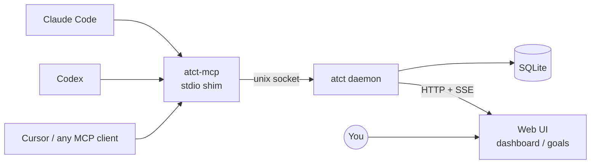

# ATCT

**The air traffic control tower for your coding agents.**

A controller tracks many aircraft at once without flying any of them. When an aircraft needs a
decision, the controller issues a *clearance*; until it arrives, the aircraft *holds short* — it
stops before the runway and waits, without anyone taking the controls.

ATCT is that tower for coding agents. You set a goal. Agents break it into tasks and work through
them. When an agent reaches something it should not decide alone, it parks the question for you and
keeps going where it can. You answer from one dashboard. The agent picks the answer up and continues.
When the goal is met, it comes back to you for sign-off.

---

## Install

```bash
claude plugin marketplace add michiomochi/atct
claude plugin install atct@atct
```

That is the whole install. **No Homebrew, no Go toolchain, no `PATH` to edit.** The plugin
ships wrappers that fetch the two binaries the first time something needs them, verify them
against the release checksums, and cache them under `~/.atct/bin/`.

Restart Claude Code once — or run `/reload-plugins` — so the new MCP server is picked up.

macOS and Linux, on amd64 and arm64. Windows is not supported: the daemon talks over a Unix
domain socket.

<details>
<summary>Installing the binaries yourself</summary>

The wrappers exist so you don't have to. If you would rather manage the binaries — to pin a
version, to install offline, or to use `atct` from a shell outside any plugin:

```bash
brew install --cask michiomochi/tap/atct
# or, with a Go toolchain:
#   go install github.com/michiomochi/atct/cmd/atct@latest
#   go install github.com/michiomochi/atct/cmd/atct-mcp@latest
```

Note that the wrappers do not consult `PATH`. They always run the binary matching the
plugin's own version, so an agent never talks to a daemon built from a different release than
the tool definitions it was given. Installing the binaries yourself gives you `atct` in any
shell; it does not change what the plugin runs.

</details>

## Getting started

Register the repository once, from inside it:

```bash
cd /path/to/your/repo
atct project add
```

That is the only thing the terminal is needed for. Open <http://127.0.0.1:8787/> and create
your first goal there — **everything a human does happens on the dashboard.** The daemon
starts on its own the first time anything needs it.

A goal is one field. Write what you want in as much or as little detail as you like; the
first line is what lists and links show, and anything after it is the detail.

From then on, opening Claude Code in a registered repository is enough. A session hook hands
the agent the active goals — their `goal_id`, what each one says, the tasks under them, and any
answer waiting to be picked up — so it knows what it is working on before you type anything.
**Repositories you never registered are untouched**: the hook stays silent, so unrelated work
does not pay for a ceremony it did not ask for.

`atct daemon start` and `atct daemon stop` are there if you ever need to restart it by hand.

## Setting a goal is the approval

An active goal is permission to work. The agent breaks it into tasks and starts — it does not
come back for sign-off on the plan, and it does not stop between tasks. Your attention goes to
the decisions it parks and to the final approval, not to granting permission at every step.

It stops before anything that cannot be undone: rewriting history, discarding uncommitted work,
deleting files, or publishing off the machine. The test is whether **you can get the previous
state back** — a commit is undoable, a force push over work that exists nowhere else is not.

Say `/atct:start` to hand a session that responsibility explicitly. Whoever runs it owns what
ATCT says about this repository: every claim, every completed task, every parked decision.

Your side of it is three things: answer the decisions that are parked, approve or send back the
completion report when a goal claims to be finished, and approve or reject the goals an agent
proposes. Everything else runs without you.

## Your answer reaches a session that already moved on

Agents stop when a turn ends. Polling does not help — polling is a tool call, so it ends with
the turn. That is the gap where an answer normally goes unread: you reply, and nobody is
listening any more.

ATCT closes it from the outside. When a session is about to finish and an answer is waiting,
a stop hook hands it back with the `decision_id` to pick up, and the work you were blocking
continues. You do not have to time your reply to when an agent happens to be looking.

## Starting work while you sleep

The stop hook only reaches a session that is still open. To pick work up from nothing —
after you answered overnight, or after you added a goal and closed the laptop — ask ATCT
whether there is anything to do:

```bash
atct context --check    # exit 0: there is work. exit 1: nothing to do
```

It prints nothing, so it composes with anything that runs on a schedule:

```bash
# every 15 minutes, start a session only when there is something to start it for
*/15 * * * * cd /path/to/repo && atct context --check && claude -p "/atct:start"
```

Work means an unapplied answer, an unclaimed task, or an active goal nobody has broken down
yet. **A task someone is already working on does not count** — waking a second session for it
gets the same work done twice.

For harnesses without a stop hook, such as Codex, this is the whole mechanism rather than a
supplement to one.

---

## The problem

Running several coding agents at once is now normal. Keeping track of them is not.

What you need to know is narrow: **which tasks are in flight, which ones are waiting on a decision
from me, and what is queued next.** What you get instead is a row of terminal panes, each holding a
conversation you would have to read to find out.

The gap is more fundamental than a missing dashboard:

- **Agent runtimes do not expose task state.** Claude Code's todo list has exactly three statuses —
  `pending`, `in_progress`, `completed`. None of them means "waiting on a human". Session
  transcripts carry no stable field for the current task, why a run stopped, or what it intends to
  do next. Codex is the same. Task state cannot be recovered by watching agents, however closely you
  watch them.
- **Approval workflows only handle decisions someone anticipated.** Jira Service Management, Asana
  approvals, and every BPM engine model approval steps configured by an administrator ahead of time.
  An agent that runs into a real design question mid-implementation cannot mint a new one with its
  own options.
- **Nothing delivers an answer back into a running session.** Tools in this space route around the
  problem rather than solve it — the closest one spawns a fresh one-shot process and files its
  output as a reply.

So decisions end up where nobody can see them: inside one agent's conversation, in one pane, on a
screen you happen not to be looking at. Work stalls and nothing surfaces it.

## What ATCT does

**Decisions are first-class objects, not messages in a transcript.** An agent creates one during a
run, with its own question and its own options, and hands it to a store that outlives the session
that created it.

**Waiting is derived, never stored.** A task is waiting on you precisely when it has an open
decision attached. There is no separate status to fall out of sync, so the board cannot claim a task
is blocked when nothing blocks it, or show one running while a question sits unanswered.

**An answer is not finished until it lands.** Decisions move through three states:

```
open ──(you answer)──> answered ──(the agent picks it up)──> applied
```

You having answered and the agent having received that answer are different facts. If a session dies
between them, the decision stays at `answered` and is visible as such, instead of looking handled
while the work quietly stops.

**One dashboard.** Every unanswered decision across every project lands in the same list, including
"this goal looks complete, approve it?". Watching that one list is enough to never miss one.

**Agents keep working.** A parked decision blocks one task, not the goal. The agent moves to
whatever else is ready and comes back when you answer.

## How it fits together



Agents reach ATCT over MCP, so anything that speaks MCP works — the Claude Code plugin is a
convenience, not the interface. For other harnesses, point them at `atct-mcp` and you have the same
eight tools. Everything runs on your machine: two binaries, a SQLite file, and a browser tab. No
account, no server, no data leaving the host.

ATCT does not start, stop, or supervise agents. It holds the tasks and the decisions. How you run
agents stays your business.

## Concepts

| | |
|---|---|
| **Project** | A project. Derived from the working directory, so agents never have to name it |
| **Goal** | What you want, in one field. Active means agents may work on it |
| **Task** | A unit of work toward the goal. Agents declare and claim these |
| **Work lock** | The claim on a task. One agent session holds it, so two never take the same task |
| **Decision** | A question an agent cannot settle alone, with options it wrote itself |

A goal is `active`, `proposed`, `done`, or `dropped`. **You create goals active.** An agent
can propose one — it lands as `proposed` and does nothing until you approve it, which is the
one place an agent gets to suggest what to work on. A goal you no longer want is withdrawn
with a reason, from its own page; that closes its open decisions and its unfinished tasks
along with it.

Every option carries a `consequence` — what happens if you pick it. You should be able to decide
without going back to ask what the choice actually means.

Several agents can work one goal at the same time. Tasks are claimed atomically, so two agents never
hold the same one.

## The screens

- **Dashboard** — goals an agent has proposed, then every unanswered decision across every
  project, then the goals themselves grouped by project. The one screen that matters.
- **Goal detail** — what is running now, what needs a decision, what is queued next, the
  completion report when there is one, and the controls for approving or withdrawing the goal.
- **Task detail** — the task, its answer history, and the commits it produced, with the diff
  of each one readable in place.

Decisions are answered where they appear: the question, the options and their consequences, and
a free-text field for answers that are not on the list.

## What ATCT is not

- Not a dependency graph — that is [Beads](https://github.com/gastownhall/beads)' job
- Not an agent multiplexer or supervisor — that is a terminal multiplexer's job
- Not token and cost observability — that is Langfuse and AgentOps' job
- Not a general blocker tracker; the only thing ATCT waits on is a human decision

ATCT holds tasks and the decisions attached to them. That is the whole product.

## Design

The design is written up in full:

- [`doc/specs/2026-08-15-atct-design.md`](doc/specs/2026-08-15-atct-design.md) — data model, state
  machine and invariants, MCP contract, topology
- [`doc/plans/2026-08-15-atct-core.md`](doc/plans/2026-08-15-atct-core.md) — the implementation,
  written test-first, task by task

Requires Go 1.26+, plus Node 22.12+ and pnpm. The web assets are built, not committed, and the
daemon embeds them, so a build needs both toolchains.

## Contributing

Read [CONTRIBUTING.md](CONTRIBUTING.md). Open an issue before writing anything larger than a bug
fix — design decisions follow the spec, and a change that contradicts it needs the spec updated
first.

Contributions require signing a CLA. It grants permission, it does not transfer copyright; the
reasoning is in CONTRIBUTING.md.

## License

[AGPL-3.0](LICENSE).

Running ATCT — modified or not, personally or across your company — carries no obligations. The
copyleft applies if you modify it and serve it to others over a network.

**Using ATCT does not put your code under AGPL.** It runs as its own process and agents reach it
over MCP, which is inter-process communication, not linking. Your agents, your applications, and
everything else on your machine keep whatever license they already had.
