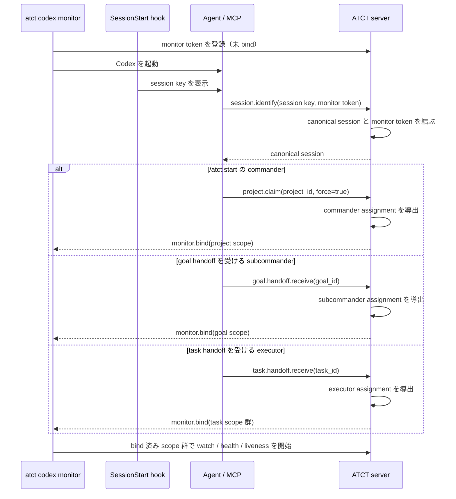

# Bootstrap

ATCT の role は起動引数や agent の自己申告で選ばない。server が canonical session に紐づく
claim と handoff から導出する。起動時に必要なのは session と monitor を結び、導出済みの scope
だけを monitor へ渡すことである。

## 用語

| 用語 | 意味 |
| --- | --- |
| session key | harness の SessionStart が出す不透明な `session_id`。agent は変更せず identify に渡す。 |
| canonical session | session key に結び付いた ATCT の agent session。claim と handoff の所有者である。 |
| assignment | canonical session から導出した role と scope の組。role は commander / subcommander / executor。 |
| monitor token | `atct codex monitor` が起動時に作る不透明な識別子。monitor と canonical session を結ぶ。 |
| scope | commander の project、subcommander の goal、executor の task handoff。executor は複数 scope を持ち得る。 |

## 原則

- role は server が導出する。CLI の `--role`、`--project`、`--goal`、`--task` で指定しない。
- authorization は server が canonical session から毎回判定する。monitor の scope は通知・health・liveness
  の配送先を決めるだけで、権限を与えない。
- executor に「一つの task」は仮定しない。open かつ受領済みの task handoff ごとに scope を持つ。
- `atct_role` は agent が role を診断する API として残す。通常の monitor bind の入力にはしない。

## 起動フロー



`session.identify` は identity を結ぶだけで role を作らない。claim または handoff の受領が成功した応答で
assignment が更新され、server は monitor を再 bind する。agent は必要なら `atct_role` で導出結果を診断できる。

monitor は session key を推測しない。起動時に作った monitor token を SessionStart / MCP 経路で
`session.identify` へ渡し、server が token と canonical session を結ぶ。

## assignment を作る起動操作

session を identify した直後に、起動元と受領者が次の操作を行う。handoff を作る側は新しい generic
monitor session を起動し、受領者に対象 ID を渡す。monitor の role / scope は渡さない。

| 起動する role | 起動元が先に行うこと | 起動した session が行うこと | bind 結果 |
| --- | --- | --- | --- |
| commander | — | `/atct:start`: `atct_goal_list` で project ID を得て、`atct_project_claim(project_id, force=true)` | project scope |
| subcommander | commander が `atct_goal_handoff_request` し、goal ID を渡す | `atct_goal_handoff_receive(goal_id)` | goal scope |
| executor | subcommander が `atct_task_handoff_request` し、task ID を渡す | `atct_task_handoff_receive(task_id)` | 受領済み task handoff ごとの scope |

project claim は commander を作る。goal / task handoff の request は受領者の assignment をまだ変えず、
受領者が receive したときにだけ変える。executor が後から別の task handoff を receive した場合も、server は
scope を追加して monitor を再 bind する。

## assignment の導出

server は状態を次の順で評価する。

| role | 導出根拠 | scope |
| --- | --- | --- |
| commander | project claim を canonical session が保有する | その project |
| subcommander | open かつ受領済みの goal handoff を canonical session が保有する | その goal |
| executor | open かつ受領済みの task handoff を canonical session が保有する | 各 task handoff |

複数の根拠がある場合も server が明確な優先順位と scope 集合を返す。曖昧な task を client 側で一件だけ
選ばない。

## scope の更新

assignment は起動時だけの固定値ではない。project claim、goal / task handoff の receive・review・complete・
recovery で変化する。server は該当 canonical session の assignment を再計算し、紐付いた monitor へ
`monitor.bind` 更新を送る。

monitor は bind 前には agent action を配送せず、project 全体を仮の executor scope として監視しない。
bind 後に scope ごとの snapshot を取得してから event を処理するため、識別中の通知を取りこぼさない。
assignment が空になった monitor は health と liveness を停止し、次の bind 更新を待つ。

## Codex の起動

Codex は常に次で起動する。

```sh
atct codex monitor -- <codex args>
```

`--role`、`--project`、`--goal`、`--task` は bootstrap 完了前に scope を固定してしまうため廃止する。
通常の Codex process を後から monitor に変えることはできない。新しい session をこの入口から起動する。

## 現状との差

現状の `session.identify` は canonical session の関連付けだけを返し、role / scope を返さない。agent は
続けて `atct_role` を呼ぶ。Codex monitor は role と scope を起動引数で解決し、未指定の monitor は
unscoped watch になる。

この文書の bootstrap は未実装の目標仕様である。実装後は `doc/continuous-execution.md` と
`skills/atct/SKILL.md` の旧起動形式をこの仕様へ更新する。
