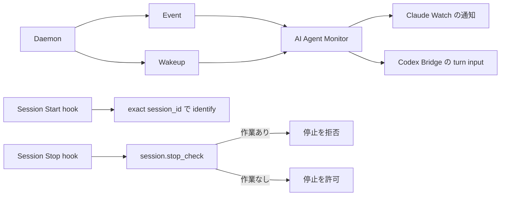
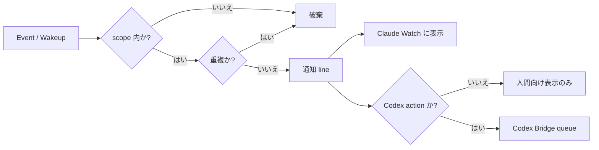

# 継続実行

ATCT は、daemon が状態を通知し、AI Agent Monitor が対象の agent へ届け、AI Agent Hook が
session の開始と停止を扱う。この文書では、その三つを発生源ごとに分けて説明する。

# 全体像



daemon の 30 秒ごとの wakeup 評価は、30 秒ごとの通知を意味しない。通知にはそれぞれ別の
発生条件・待ち時間・重複抑止がある。

# Daemon通知

daemon は二種類の通知を作る。Event は状態変化、Wakeup は一定時間続く作業可能状態・接続状態・
整合性問題を表す。

## Event

Event は decision または handoff の状態が変わった時点で発行される。待ち時間はない。

| 例 | 意味 | 次の行動 |
| --- | --- | --- |
| decision の回答・適用 | 人間または agent の判断が workflow に入った | 必要なら回答を apply し、次の workflow へ進む |
| goal / plan / task handoff の request・receipt | 作業の委譲または受領が進んだ | 受領者は自分の role と scope を確認して作業を進める |
| review・completion | review または完了報告が進んだ | reviewer / 依頼者が次の review・completion を行う |

同じ対象に対する同じ Event は monitor 側で重複を抑止する。`handoff yielded` という Event はない。

## Wakeup

Wakeup は、作業可能な状態または解消されない問題が一定時間続いた時に通知する。評価・状態保持・
発行経路は一つであり、通知対象と頻度だけが異なる。

| Wakeup | 発生条件 | 頻度 | 次の行動 |
| --- | --- | --- | --- |
| actionable wakeup | 実行可能な task が残る | 3 分継続後、以後 3 分ごとに候補 | scope 内で次に実行できる task を role が進める |
| goal の completion report / commit 欠落、task 未宣言・全 dropped・unclaimed doing | 15 分継続 | 状態を修正するか、意図した状態に必要な記録を補う |
| handoff 未受領、completion report 欠落、handoff なしの claim | 30 分継続 | receipt、review、completion report、recovery の不足を確認する |
| stale claim、default answer 未適用 | 3 分継続 | claim または decision の反映状態を確認して進める |
| human answer 済みで未適用 | 即時 | 回答を apply する |
| `wakeup.monitor_lost` | monitor health の最終更新から 75 秒 | 親 role が handoff recovery または worker 再作成を選ぶ |
| keepalive | daemon が正常に評価を続けている | 30 秒ごとに内部発行 | 通常は表示しない |
| keepalive missing | watch が keepalive を受けない | 90 秒後に一度 | watch / daemon 接続を確認する。業務 task の担当通知ではない |

同じ Wakeup の表示内容は抑止される。人間判断待ちだけの task は actionable wakeup の対象ではない。
対象状態が消えるまで、問題を知らせる Wakeup は対象ごとに一度だけ通知する。`wakeup.*` は
すべて Wakeup の event 名であり、別の概念や評価機構ではない。

`wakeup.monitor_lost` は executor の場合は subcommander、subcommander の場合は commander に
届く。Codex process の自動再起動や handoff の自動回復・再割当は行わない。

# AI Agent Monitor

AI Agent Monitor は daemon 通知を受け、scope と重複を処理し、Claude の通知または Codex の
turn input へ変換する。Monitor は通知経路であり、Session Start / Stop hook ではない。

## 配送の仕組み



scope は届け先の境界であり、Session Stop の role 解決とは別である。

| scope | 主な利用者 | 届くもの | 届かないもの |
| --- | --- | --- | --- |
| project | commander | human answer、goal approval / rejection、goal.created、goal-level Wakeup、goal handoff | task-only handoff / Wakeup、default answer、unapplied task decision |
| goal | subcommander | その goal の Event、Wakeup、task-level 通知 | 他 goal の通知 |
| task | executor | その task の handoff と Wakeup | 他 task / 他 goal の通知 |

## Claude Watch

Claude は SessionStart の monitor token で起動した persistent watch を一つだけ使う。
`atct watch --monitor --token <monitor_token>` は token に結び付いた canonical session の
assignment を server から取得し、claim / handoff に伴う scope の変更も追従する。role や scope を
起動引数で指定しない。

Claude Watch は通知を表示する。Session を停止するには、この session に attach された monitor の
task ID が分かる時だけ `TaskStop` を使う。ID は推測しない。

## Codex Bridge

Codex monitor は、新しい interactive process を wrapper で起動する。

```sh
atct codex monitor -- <codex args>
```

Bridge は action と判定された通知 line だけを queue に入れ、Codex thread が idle になった時に
FIFO で turn input を開始する。snapshot・SSE・daemon ensure の一時的な失敗は watch が再接続
して吸収する。Bridge 自体または action sink が失敗すると monitor は無効化されるが、Codex
session 自体は終了させない。

assignment-bound monitor は、scope に人間回答待ちがなく、その role が次に実行できる ATCT 操作が
ある場合だけ、1 分ごとに liveness prompt を queue する。これは Wakeup を agent が見落とした
まま止まらないための再確認であり、権限や人間判断を与えるものではない。

## 停止・再開

Codex monitor を止める時は、監視対象と同じ project directory で次を実行する。

```sh
atct codex monitor stop
```

これは該当 project の live supervisor だけを対象とし、daemon は停止しない。stop が status 0 で
成功した後だけ、新しい monitor を起動できる。`start`、`restart`、`exit`
という monitor subcommand はない。

通常の Codex process を後から monitor に変えることはできない。未コミット作業がある場合は保存
または handoff して終了し、新しい monitor process を起動する。`/atct:start` も monitor
の start / attach は行わない。

# AI Agent Hooks

Hook は harness の session lifecycle を ATCT へつなぐ。Monitor の通知配送とは別の経路である。

## Session Start

登録済み project では、Claude / Codex の SessionStart input に含まれる `session_id` を session
key として使う。hook は次の案内を出す。

```text
ATCT session key: <session_id>. Before any other ATCT operation, call atct_session_identify with this exact session_key and monitor_token <monitor_token>.
```

agent は最初の ATCT 操作として、その二つの値を一文字も変えずに
`atct_session_identify(session_key=<session_id>, monitor_token=<monitor_token>)` へ渡す。これで
transport の session、canonical agent session、monitor が結び付く。SessionStart key が出なかった
場合だけ stable な full agent name を fallback にできる。

Claude の SessionStart は context を表示し、context がある時は daemon も開始する。session key は
cwd、PID、role 名から推測しない。

## Session Stop

Claude と Codex の Stop hook は生の hook JSON を次へ渡す。

```text
atct stop-check --hook-input
```

CLI は `session_id` を daemon の `session.stop_check` へ渡す。daemon は key から canonical session
と role を解決するため、Stop hook が role、project、goal、task を環境変数から受け取る必要はない。
Codex monitor が Stop hook 用に渡す環境変数は `ATCT_MONITOR_TOKEN` だけである。

| 状態 | Stop hook の結果 |
| --- | --- |
| `stop_hook_active: true` | 空出力で許可（再帰を防ぐ） |
| identified session に作業がない | 空出力で許可 |
| identified session に作業が残る | `{"decision":"block","reason":"ATCT work remains: ..."}` |
| session 未識別、入力不正、RPC / state 読取り失敗 | `{"decision":"block","reason":"ATCT stop-check failed: ..."}` |

| role | 停止を拒否する未完了作業 |
| --- | --- |
| commander | claim 済み project の active goal |
| subcommander | 自身が受領した open goal handoff、自身に戻った plan rejection、自身が受領した task-create handoff、その goal の task review |
| executor | 自身が受領した全 open task handoff |

Stop hook は fail closed の判定だけを行う。monitor / daemon の停止、handoff の完了・回復、Codex の
再開は行わない。複数の executor handoff が残っている場合も、一つでも open なら停止を拒否する。

# 実装との対応

| 責務 | 主な実装 |
| --- | --- |
| Event、Wakeup、monitor lost | `internal/daemon/wakeup.go`、`internal/store/wakeup.go` |
| scope filter、重複抑止、liveness | `cmd/atct/watch.go`、`cmd/atct/watch_scope.go` |
| SSE | `internal/httpapi/server.go` |
| Codex monitor / Bridge | `cmd/atct/codex_monitor*.go`、`cmd/atct/codex_monitor_supervisor.go` |
| Session Start / Stop hook | `hooks/session-start`、`hooks/stop`、`hooks/codex-hooks.json` |
| session key と Stop 判定 | `cmd/atct/session_key.go`、`cmd/atct/stop_check.go`、`internal/daemon/stop_check.go` |

単体・結合テストは各実装の `*_test.go` に置かれている。実時間の ticker、実 daemon / SSE 接続、
実 Codex process、harness が発火する plugin hook 自体は自動テストの対象外である。
