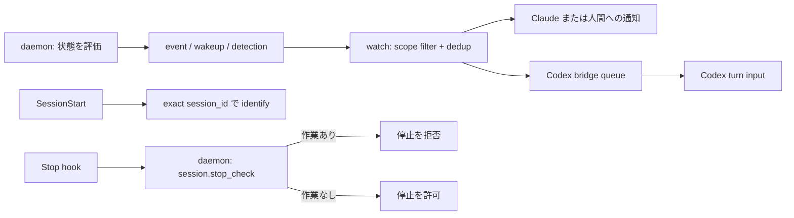
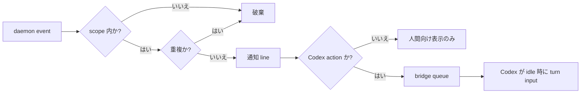

# 継続実行

この文書は、ATCT が「作業を続けるべき session」に何を届け、誰が次に何をするかを説明する。
実装上のイベント名やタイマーは手段であり、本文ではまず運用上の意味を示す。最新の厳密な
条件は daemon / watch の実装を正とする。

## 全体像

継続実行は三つの経路で成り立つ。

1. daemon が作業停止・状態変化・健全性低下を検出する。
2. watch が scope と重複を処理して、関係する人または agent だけに届ける。
3. Stop hook が session 自身の未完了作業を確認し、作業が残る限り停止を拒否する。



30 秒ごとに走る daemon maintenance は、通知を必ず 30 秒ごとに出すものではない。各通知には
別の発生条件と待ち時間があり、watch も重複を抑止する。

## 1. session を開始し、停止を判定する

### SessionStart

登録済み project では、Claude / Codex の SessionStart hook が harness の `session_id` を受ける。
hook は次の案内を出す。

```text
ATCT session key: <session_id>. Before any other ATCT operation, call atct_session_identify with this exact session_key.
```

agent は最初の ATCT 操作として、表示された値を一文字も変えずに
`atct_session_identify(session_key=<session_id>)` へ渡す。これにより transport の session と
ATCT の canonical agent session が結び付く。SessionStart key が出なかった場合だけ、stable な
full agent name を fallback にできる。

Claude の SessionStart は context を表示し、context がある時は daemon も開始する。Codex の
explicit monitor session も同じ key 案内を受ける。session key は cwd、PID、role 名から推測しない。

### Stop hook

Claude と Codex の Stop hook は、生の hook JSON を同じコマンドへ渡す。

```text
atct stop-check --hook-input
```

CLI は `session_id` を daemon の `session.stop_check` へ渡す。daemon は key から canonical
session と role を解決するため、Stop hook が role、project、goal、task を環境変数から受け取る
必要はない。Codex monitor が Stop hook 用に渡す環境変数は `ATCT_BIN` だけである。

| 状態 | Stop hook の結果 |
| --- | --- |
| `stop_hook_active: true` | 空出力で許可（再帰を防ぐ） |
| identified session に作業がない | 空出力で許可 |
| identified session に作業が残る | `{"decision":"block","reason":"ATCT work remains: ..."}` |
| session 未識別、入力不正、RPC / state 読取り失敗 | `{"decision":"block","reason":"ATCT stop-check failed: ..."}` |

これは fail closed の判定であり、monitor の停止・daemon の停止・handoff の完了や回復は行わない。

| role | 停止を拒否する未完了作業 |
| --- | --- |
| commander | claim 済み project の active goal |
| subcommander | 自身が受領した open goal handoff、自身に戻った plan rejection、自身が受領した task-create handoff、その goal の task review |
| executor | 自身が受領した全 open task handoff |

複数の executor handoff が不整合に残っていても、一つでも open なら停止を拒否する。

## 2. どんな通知が出るか

通知は「今すぐ作業を進められる」「状態を確認・復旧する」「状態が変わった」の三種類に分ける。
この分類を先に読むと、個々の待ち時間を暗記する必要がない。

### 作業を進められる通知

| 通知 | 発生条件 | 待ち時間 / 再送 | 受け手の次の行動 |
| --- | --- | --- | --- |
| actionable wakeup | 実行可能な task が残る | 条件が 3 分継続後。以後は 3 分ごとに候補になる | scope 内で次に実行できる task を選び、担当 role が進める |
| liveness prompt | explicit Codex monitor の role に、今すぐ実行できる ATCT 操作がある | 1 分ごと | role の未完了作業を再確認して進める |

同じ actionable wakeup の表示内容は watch が抑止する。人間判断待ちだけの task は、actionable
wakeup の対象ではない。liveness prompt も、人間回答待ち・完了済み handoff・他者が作業中な
だけの scope には送らない。

### 状態を確認・復旧する通知

| 通知 | 発生条件 | 最初に出るまで | 受け手の次の行動 |
| --- | --- | --- | --- |
| goal の完了報告 / commit 欠落、task 未宣言・全 dropped・unclaimed doing | goal または task の整合性が崩れている | 15 分 | 状態を修正するか、意図した状態なら必要な記録を補う |
| handoff 未受領、completion report 欠落、handoff なしの claim | handoff 契約が途中で止まっている | 30 分 | 受領・review・completion report・recovery のどれが不足しているか確認する |
| stale claim、default answer が未適用 | claim または既定判断の反映が止まっている | 3 分 | claim / decision の反映状態を確認して進める |
| human answer 済みで未適用 | 人間回答を記録したが workflow へ反映していない | 即時 | 回答を apply する |
| keepalive missing | watch が 90 秒間 daemon keepalive を受けない | 90 秒後に一度 | watch / daemon 接続を確認する。業務 task の担当通知ではない |
| `detection.monitor_lost` | open handoff の monitor が停止、または health lease を失う | health の最終更新から 75 秒後 | 親 role が handoff recovery または worker 再作成を選ぶ |

同じ detection condition と対象の組合せは、一度通知した後、条件が消えるまで再送しない。
`detection.monitor_lost` は executor なら subcommander、subcommander なら commander に届く。
Codex process の自動再起動や handoff の自動回復・再割当はしない。

### 状態が変わった通知

decision の回答・適用、goal / plan / task handoff の request・receipt・review・completion などは
状態変化時に event として出る。wait 時間を待つ detection と違い、状態変化そのものを届ける。
同じ対象への同じ event は watch が抑止する。`handoff yielded` という別の通知は存在しない。

## 3. 誰に届くか

watch の scope は delivery の境界であり、Stop hook の role 解決とは別である。

| scope | 主な利用者 | 届くもの | 届かないもの |
| --- | --- | --- | --- |
| project | commander | human answer、goal approval / rejection、goal.created、goal-level detection、goal handoff | task-only handoff / detection、default answer、unapplied task decision |
| goal | subcommander | その goal の decision、handoff、detection、task-level 通知 | 他 goal の通知 |
| task | executor | その task の handoff と detection | 他 task / 他 goal の通知 |

Claude は role に応じて persistent watch を一つだけ付ける。commander は project scope、
subcommander は goal scope を使う。同一 scope の既存 watch は起動時に整理される。

Codex は新しい interactive process を monitor wrapper で起動する。

```sh
atct codex monitor --role commander -- <codex args>
atct codex monitor --role subcommander --goal <goal_id> -- <codex args>
atct codex monitor --role executor --task <task_id> -- <codex args>
```

通常の Codex process を、後から monitor に変えることはできない。`/atct:start` も monitor の
start / attach は行わない。

## 4. Codex への配送

daemon event は SSE に出た後、watch の scope filter と重複抑止を通る。人間向けに表示される
line のすべてが Codex へ送られるわけではない。action と判定された line だけが bridge queue
へ入り、Codex thread が idle になった時に FIFO で turn input になる。



snapshot・SSE・daemon ensure の一時的な失敗は watch が再接続して吸収する。bridge 自体または
action sink が失敗すると monitor は無効化されるが、Codex session 自体を終了させない。

## 5. 停止、復旧、再開

Stop hook は「agent の turn を止めてよいか」の判定である。monitor を止める操作ではない。

- Claude の monitor を止める時は、この session に attach された task ID が分かる場合だけ
  `TaskStop` を使う。ID を推測しない。
- Codex monitor を止める時は、監視対象と同じ project directory で
  `atct codex monitor stop` を実行する。この操作は該当 project の live supervisor だけを対象とし、
  daemon は停止しない。
- Codex monitor を再開するのは、stop が status 0 で成功した後だけである。explicit role command
  で新しい process を起動する。`start`、`restart`、`exit` の monitor subcommand はない。

`resume` は通常 Codex の引数としては pass-through できるが、explicit role monitor の先頭引数
としては使えない。未コミット作業がある通常 Codex を monitor 化したい場合は、作業を保存または
handoff して終了し、新しい explicit monitor process を起動する。

## 実装との対応

| 責務 | 主な実装 |
| --- | --- |
| maintenance、wakeup、detection、monitor lost | `internal/daemon/wakeup.go`、`internal/store/wakeup.go` |
| SSE と scope filter、重複抑止、liveness | `cmd/atct/watch.go`、`cmd/atct/watch_scope.go`、`internal/httpapi/server.go` |
| Codex monitor / bridge | `cmd/atct/codex_monitor*.go`、`cmd/atct/codex_monitor_supervisor.go` |
| SessionStart / Stop hook | `hooks/session-start`、`hooks/stop`、`hooks/codex-hooks.json` |
| session key と Stop 判定 | `cmd/atct/session_key.go`、`cmd/atct/stop_check.go`、`internal/daemon/stop_check.go` |

単体・結合テストは各実装の `*_test.go` に置かれている。実時間の ticker、実 daemon / SSE 接続、
実 Codex process、harness が発火する plugin hook 自体は自動テストの対象外である。
