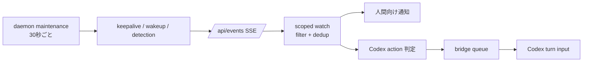
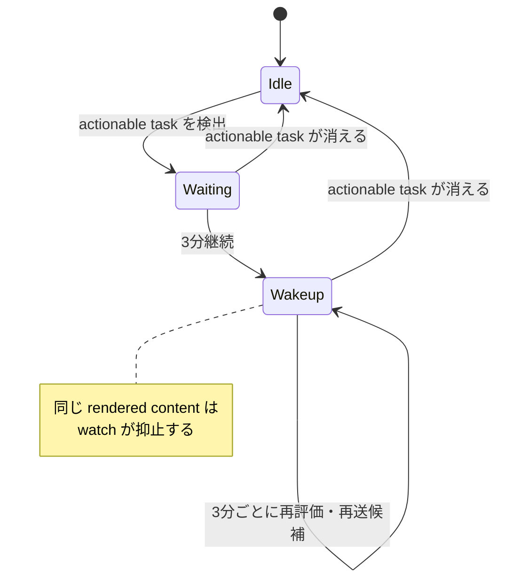
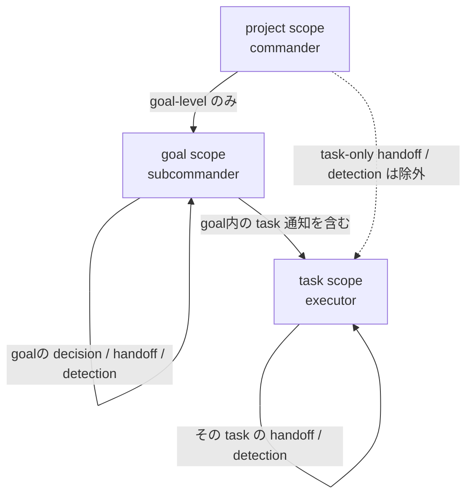
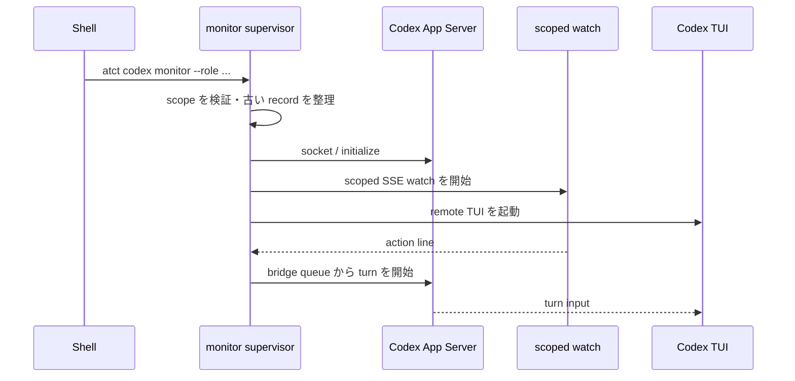
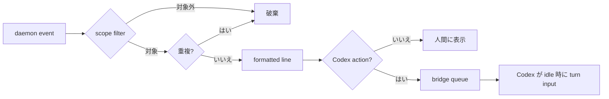
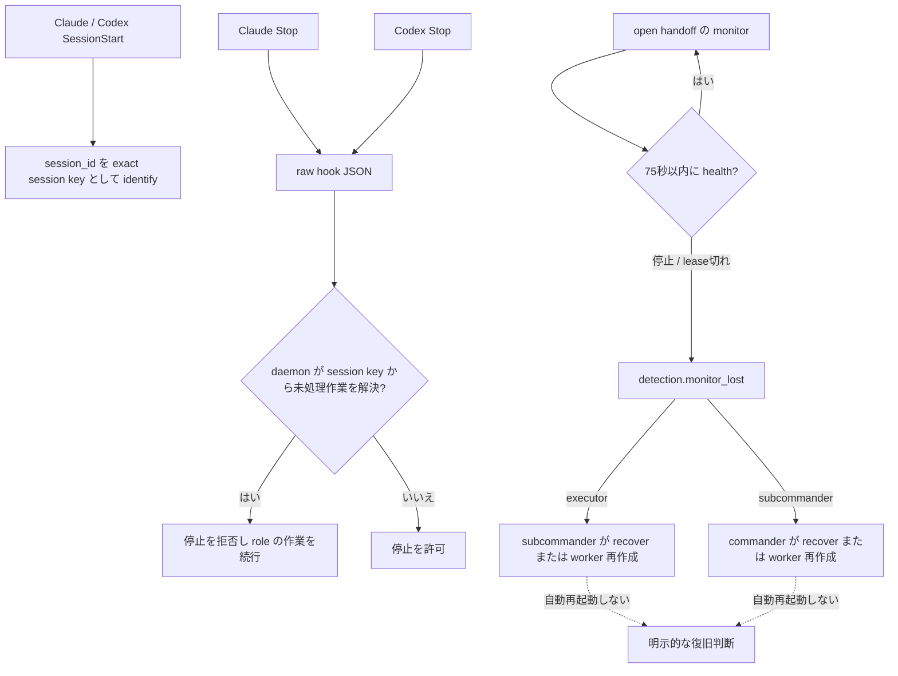

# 継続実行の通知と担当

この文書は、daemon の定期評価から利用者または Codex への通知までを、
「評価の周期」「通知として見える周期」「誰が反応するか」に分けて説明する。

## 全体像

処理の境界は次のとおりである。

```text
daemon maintenance
  -> keepalive / wakeup / detection を発行
  -> /api/events の SSE
  -> watch の scope filter と重複抑止
  -> 人間の通知行、または Codex monitor の turn input
```



30 秒は daemon が評価を試みる周期であり、actionable wakeup が 30 秒ごとに表示される
という意味ではない。`Daemon.Serve` は 30 秒 ticker ごとに `runMaintenance` を呼び出す
（`internal/daemon/server.go:146-169`）。maintenance は keepalive を発行してから
wakeup/detection を評価する（`internal/daemon/wakeup.go:375-404`）。

## 周期と可視性

| 信号 | 発行条件・初回待ち | 再送 | watch での扱い |
| --- | --- | --- | --- |
| maintenance 評価 | daemon 起動後、30 秒 ticker ごとに評価（`internal/daemon/server.go:146-169`） | 30 秒ごとに評価を試みる | 評価そのものは通知行ではない |
| keepalive | 各 maintenance で発行（`internal/daemon/wakeup.go:379-384`） | 30 秒ごと | 通常は表示しない。90 秒来なければ `daemon keepalive missing` を 1 行出す（`cmd/atct/watch.go:583-625,933-938`） |
| actionable wakeup | `state.Tasks` が空でない状態を検出し、最初の検出から 3 分後に発行（`internal/daemon/wakeup.go:156-168`） | 最後の発行から 3 分ごと（`internal/daemon/wakeup.go:166-187`） | rendered content が同じなら抑止する（`cmd/atct/watch.go:791-809`） |
| detection | 条件ごとの別タイマー。下表を参照（`internal/daemon/wakeup.go:192-285`） | 同じ detection condition/target は一度だけ。条件が消えると追跡状態を消す（`internal/daemon/wakeup.go:62-96,291-300`） | detection ID ではなく target 単位で抑止する（`cmd/atct/watch.go:759-789`） |
| decision / handoff | decision または handoff の状態変化時 | event と対象に応じて抑止 | scope filter 後に人間向け行または Codex action line になる（`cmd/atct/watch.go:736-838,840-898`） |

### actionable wakeup の条件

tracker は actionable task の一覧 `state.Tasks` を条件にする。条件が消えると
`activeSince` と `published` を削除し、再び現れた時は新しい 3 分待ちを始める
（`internal/daemon/wakeup.go:156-170`）。未開始 task の総数は別に数えられるが、open
decision に紐づく task は `WaitingAnswerTaskCount` にだけ入り、`state.Tasks` には入らない
（`internal/store/wakeup.go:310-337`）。従って、待ち回答 task だけの状態は actionable
wakeup の対象ではない。

初回 3 分・状態リセット・fresh ID は
`internal/daemon/wakeup_test.go:100-183,319-379`、3 分再送は
`internal/daemon/wakeup_test.go:381-415` で確認されている。



### detection の別タイマー

下記は actionable wakeup の 3 分とは別の detection 条件である。

| detection | 初回待ち | 根拠 |
| --- | --- | --- |
| completed goal の completion report 欠落、commit 欠落、task 未宣言、全 task dropped、unclaimed doing | 15 分 | 定数 `wakeupPublishAfter`（`internal/daemon/wakeup.go:17-24`）と発行対象（`internal/daemon/wakeup.go:226-240`） |
| handoff 未受領、handoff completion report 欠落、handoff なしの claim | 30 分 | `internal/daemon/wakeup.go:25-27,241-268` |
| human answer 済みだが未適用 | 即時（0） | `internal/daemon/wakeup.go:28,270-272` |
| default answer 未適用、stale claim | 3 分 | `internal/daemon/wakeup.go:29-30,273-285` |

## watch の開始と scope

### Claude の watch

Claude の `start` は session を識別した後、role に応じた一つの persistent watch を付ける。
commander は `atct watch -project`、subcommander は `atct watch -goal <goal_id>` を
使う。同じ session に二つの monitor を付けず、同一 scope の既存 watch は起動時に停止する
（`skills/start/SKILL.md:24-38`）。`runWatch` は cwd から project を解決し、watch を
登録・重複整理してから snapshot と SSE loop を始める
（`cmd/atct/watch.go:180-261`）。

client の scope は次のように分かれる。

| scope | 通知対象 |
| --- | --- |
| project | human answer、approval/rejection、goal.created、goal-level detection、goal handoff。task handoff、task detection、default answer、unapplied task decision は除外 |
| goal | その goal の decision/detection/handoff。task-level 通知も含む |
| task | その task の handoff と detection |

この分類は `cmd/atct/watch_scope.go:28-79` にあり、HTTP server 側の `project_id`、
`goal_id`、`task_id` filter は `internal/httpapi/server.go:1355-1408,1410-1483` にある。

project scope の wakeup は actionable goal 数、unassigned goal 数、unassigned goal ID の
変化を通知条件にする。task 内訳だけの変化は project scope では抑止される
（`cmd/atct/watch_scope.go:57-67`）。



### Codex monitor

Codex monitor は `/atct:start` の後付けではない。新しい interactive process を、次の role
指定で shell から起動する（`skills/start/SKILL.md:40-65`）。

```sh
atct codex monitor --role commander -- <codex args>
atct codex monitor --role subcommander --goal <goal_id> -- <codex args>
atct codex monitor --role executor --task <task_id> -- <codex args>
```

role と selector の関係は次のとおりである。

| role | scope | selector |
| --- | --- | --- |
| commander | project | selector なし |
| subcommander | goal | `--goal <goal_id>` 必須 |
| executor | task | `--task <task_id>` 必須 |

CLI は `--scope` を拒否し、role ごとの selector の不足・混在を拒否する
（`cmd/atct/main.go:276-325,402-425`）。explicit scope は cwd の project と照合され、
executor は task から goal を解決して同じ project であることを確認する
（`cmd/atct/codex_monitor_supervisor.go:382-434`）。

monitor lifecycle は、scope 解決、古い record の整理、managed Unix socket の App Server、
initialize、monitor record、scoped SSE watcher、bridge、remote TUI の順である
（`cmd/atct/codex_monitor_supervisor.go:74-217`）。登録済み project で通常の interactive
`codex` を shim 経由で起動した場合は、automatic commander/project scope に変換される
（`cmd/atct/codex_shim.go:181-227`）。

通常の `codex` process を起動後に monitor へ retrofit することはできない。
`/atct:start` は既存 session の goal loop に入り、monitor を start/attach しない
（`skills/start/SKILL.md:56-61`）。



## SSE から Codex への配送境界

SSE server は filter を通った event を `event` と JSON `data` の frame として送る
（`internal/httpapi/server.go:1423-1460`）。watch client は snapshot を先に処理し、その後
SSE を読み、切断時には daemon ensure と再接続を行う
（`cmd/atct/watch.go:318-414`）。

Codex monitor は同じ scoped watch loop を使う（`cmd/atct/codex_monitor.go:973-1009`）。
ただし、watch の全出力を TUI に送るわけではない。`codexMonitorWatchOutput` は通常の
formatted line を捨て、選択された action だけを bridge sink に渡す。snapshot・SSE・daemon
ensure の一時的な失敗は watch loop 内で再接続し、TUI と bridge は維持する。
bridge 自体または action sink の失敗だけが monitor を無効化するが、その場合も Codex の
session 自体は終了しない（`cmd/atct/watch.go:703-770,1583-1599`、
`cmd/atct/codex_monitor_supervisor.go:235-293`）。bridge は action line を queue し、Codex
の thread が idle になった時に FIFO で turn を開始する
（`cmd/atct/codex_monitor.go:669-729,763-817,819-933`）。

したがって、daemon は状態を発行し、SSE watch は scope/filter/dedup と人間向け表示を行い、
Codex monitor はそのうち action と判定された行を TUI の turn input に変換する。



## 同じ内容の抑止

重複抑止の単位は通知種別ごとに異なる。

| 通知 | 抑止単位 | 例外・注意 |
| --- | --- | --- |
| wakeup | watch loop ごとの最後の rendered content | daemon は再送ごとに fresh `wakeup_id` を作るが、同じ表示内容は抑止。A→B→A は最後の A を送る（`cmd/atct/watch.go:327-335,791-809`） |
| detection / goal.created | event name + goal/task/handoff/decision の target | fresh detection ID は新規通知の根拠にならない（`cmd/atct/watch.go:759-789`） |
| handoff_reported | event name + handoff target | 同じ handoff の再報告は抑止（`cmd/atct/watch.go:772-789`） |
| discrepancy / evaluate failure | event name + wakeup ID | 評価失敗は回復まで daemon 側でも同じ ID を再利用する（`internal/daemon/wakeup.go:390-403`） |
| 通常 decision | event name + decision ID + default-applied 状態 | 同じ decision の再配送を抑止（`cmd/atct/watch.go:821-837`） |

抑止 state は watch loop ごとに保持され、別の watch の通知がこの watch を抑止しない。
daemon restart 後も watch が保持する最後の wakeup content と一致する場合、再起動直後の
同一内容だけは表示しない（`cmd/atct/watch.go:327-335`）。project scope の task-only
wakeup 変化は、content 比較より前の scope filter でも抑止される
（`cmd/atct/watch_scope.go:57-67`）。

この挙動は `cmd/atct/wakeup_delivery_test.go:8-117`、
`cmd/atct/watch_scope_test.go:125-151`、
`cmd/atct/watch_test.go:990-1153,1210-1264` で確認されている。Codex bridge が
action line だけを受け取る境界は `cmd/atct/codex_monitor_test.go:682-713` で確認されている。

## keep-working、Stop、再開

### keep-working

`start` は「計画を提示して待つ」入口ではなく、active goal の loop を開始する入口である。
delegated worker は handoff を receive し、自分で task claim をせず、task 完了後も次の task
または goal に進む（`skills/start/SKILL.md:1-9,112-149`）。active goal が作業の許可であり、
task 完了は停止 checkpoint ではない（`skills/atct/SKILL.md:621-634`）。

### 共通 Stop hook と session identity

Claude と Codex は SessionStart / Stop input の harness `session_id` を同じ session key として
使う。登録済み project の SessionStart は `ATCT session key: <session_id>` を表示し、agent は
他の ATCT 操作より前に、その**完全一致の値**で `atct_session_identify` を呼ぶ。SessionStart key
が無い場合だけ stable な agent 名を fallback にできる（`hooks/session-start`、
`hooks/codex-hooks.json`、`cmd/atct/session_key.go`、`skills/start/SKILL.md`）。

Stop hook は生の JSON を `atct stop-check --hook-input` に渡す。CLI は `stop_hook_active: true`
なら空出力、そうでなければ `session_id` を daemon の `session.stop_check` へ渡す。daemon は
session key から canonical agent session と role を解決するため、Stop hook は cwd、PID、
`ATCT_ROLE`、project / goal / task 環境変数から scope を推測しない。Codex monitor が TUI に
渡す Stop-hook 用の環境変数は binary の場所である `ATCT_BIN` だけである
（`cmd/atct/stop_check.go`、`internal/daemon/stop_check.go`、
`cmd/atct/codex_monitor_supervisor.go`）。

未識別 session、入力不正、daemon RPC / state 読取り失敗は
`{"decision":"block","reason":"ATCT stop-check failed: ..."}` として fail closed になる。作業が
ない identified session は空出力、未完了作業がある session は
`{"decision":"block","reason":"ATCT work remains: ..."}` を返す。この hook は monitor、daemon、
Codex の再開、handoff の完了・回復を行わない。

判定対象は commander なら claim 済み project の active goal、subcommander なら自身が受領した
open goal handoff・自身に戻った plan rejection・自身が受領した task-create handoff・その goal の
task review、executor なら自身が受領した全 open task handoff である。複数 task handoff が残る
不整合でも一つでも open なら block する。

### monitor health の親 role 検知

scoped watch は `recovering` / `degraded` / `healthy` を monitor-health API に記録する。
正常に停止できなかった process の row は last-seen から 75 秒で通常の読取り対象から消える。
ただし、現在の open handoff の受領時点に同じ monitor が記録され、その monitor が
停止または lease 切れになった場合は `detection.monitor_lost` を出す。executor の喪失は
goal-scoped subcommander、subcommander の喪失は project-scoped commander に届く。検知は
`atct_handoff_recover` または worker の再作成を促すだけで、Codex を自動再起動せず、handoff
の回復・再割当も自動では行わない（`internal/daemon/wakeup.go`、`internal/store/store.go`）。



### role-aware liveness prompt

explicit role Codex monitor は、scope に人間回答待ちがなく、**その role が次に実行できる
ATCT 操作がある時だけ** 1 分ごとに `atct monitor liveness: recheck ...` を turn input へ
queue する。executor は実装または差し戻し対応、subcommander は task-create / task review /
自身への review rejection / executor が動いていない設計段階、commander は plan・goal review
または承認済み goal review の完了処理が対象である。reviewer や delegate が作業中なだけの
scope、完了済み handoff、人間判断待ちには送らない（`cmd/atct/watch.go:426-440`、
`cmd/atct/watch_scope.go:16-134`）。

SessionStart は context を確認し、context がある場合は daemon を start する。加えて登録済み
project では harness の `session_id` を識別用 key として出力する。keepalive は通常画面に
表示されず、90 秒欠落時の一度の警告だけが watch の接続健全性を示す
（`cmd/atct/watch.go:583-625,933-938`）。

### Claude TaskStop と Codex monitor stop

Claude で monitor を止める時は、この session に attach された monitor の task ID が取得
できる場合だけ TaskStop を呼ぶ。ID が不明なら推測しない
（`skills/stop/SKILL.md:10-18`）。

Codex monitor は、監視対象と同じ project directory で次を実行する。

```sh
atct codex monitor stop
```

この操作は exact project path の live supervisor だけを対象とし、記録済み PID と start time
が一致しない process は止めず、失敗 record を残す。ATCT daemon 自体は止めない
（`skills/stop/SKILL.md:20-36`、`internal/daemonctl/codexmonitor.go:212-259`）。

### 安全な monitor 再開

再開は `atct codex monitor stop` が status 0 を返した後に限り、role-specific command を
使う。stop が nonzero または一部失敗なら再起動しない
（`skills/stop/SKILL.md:38-56`）。`start`、`restart`、`exit` という monitor subcommand は
ない。

`resume` という語には二つの意味がある。

- `/atct:start` は monitor を開始・attach しない。通常 Codex に未コミット作業がある場合は、
  作業を保存または handoff してから正常終了し、explicit monitor command で起動する
  （`skills/start/SKILL.md:56-61`）。
- legacy no-role の `atct codex monitor -- resume ...` は通常 Codex へ pass-through できるが、
  explicit role monitor の leading `resume` は拒否される（`cmd/atct/codex_monitor_supervisor.go:84-95`）。
  monitor は新 remote TUI が作成した `thread/started` を採用する
  （`cmd/atct/codex_monitor.go:819-847`）。

## 判断例

1. **task を放置した場合**

   actionable task が検出されてから 3 分未満なら、30 秒評価は走っていても actionable
   wakeup はまだ発行されない。3 分以上続けば、commander の project scope では project-level
   wakeup として判断する。根拠は初回条件（`internal/daemon/wakeup.go:156-187`）と Claude
   commander の project scope（`skills/start/SKILL.md:24-36`）である。

2. **task-specific handoff / stale claim**

   handoff 未受領・未報告は 30 分、stale claim は 3 分の detection である
   （`internal/daemon/wakeup.go:25-30,241-285`）。task-specific に判断するなら Codex
   executor の task scope、goal 全体を管理するなら subcommander の goal scope を選ぶ
   （`cmd/atct/main.go:409-424`、`cmd/atct/watch_scope.go:41-79`）。

3. **keepalive 欠落**

   90 秒 keepalive が来ない時の行は、業務 task の担当通知ではなく watch/daemon 接続の
   健全性警告である。watch は一度警告して以後の同じ timer 状態を繰り返し表示しない
   （`cmd/atct/watch.go:607-614`）。

4. **Stop hook**

   共通 Stop hook は exact `session_id` から server 側で解決した role に未処理作業があれば
   turn の停止を拒否する。monitor を止める操作ではない。monitor を止める
   必要がある場合は、別途 exact project cwd で `atct codex monitor stop` を実行し、status 0 を
   確認してから role-specific monitor を再起動する（`hooks/stop:9-20`、
   `hooks/codex-hooks.json:3-13`、`skills/stop/SKILL.md:20-56`）。

## 検証範囲

数値・条件・role の根拠は本文中の repository source path と line reference に示した。
直接テストは本文各節に記載したが、実時間の 30 秒 ticker、実 daemon、実 SSE 接続、実 Codex
process の接続・再接続、および plugin による実際の Stop hook 起動は未検証である。
