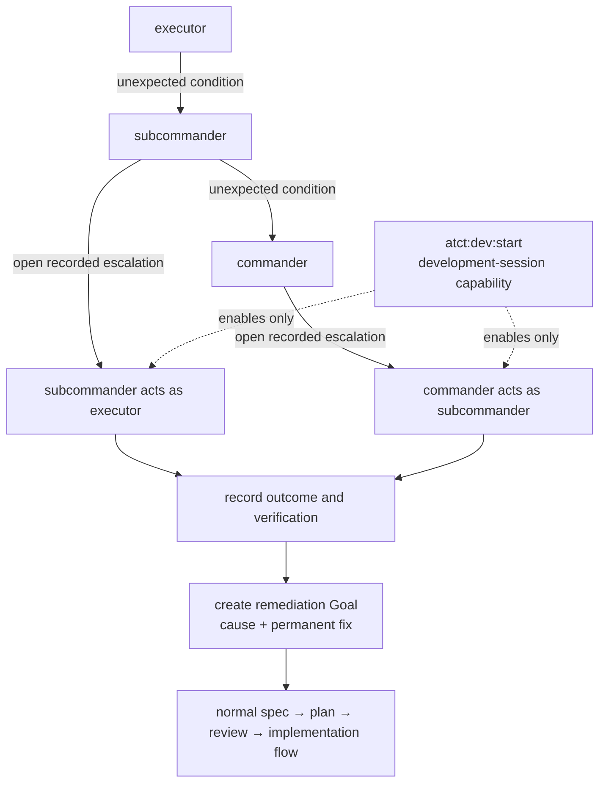

# Development escalation

## Purpose

Development sessions may recover from an unexpected failure or a specification
bug without waiting for the normal role boundary. This is a scoped break-glass
path, not a second normal workflow.

## Activation

Only `atct:dev:start` activates development mode. It identifies the session and
records a durable development-session capability in ATCT. A normal
`atct:start` session cannot open or resolve an escalation.

## Escalation

The lower role reports an unexpected condition to its direct parent:
executor → subcommander → commander. In a development-mode session, the parent
may resolve the lower-role work. A subcommander may act as executor;
a commander may act as subcommander, but never as executor. Authority never
flows down or sideways.

Development escalation also permits irreversible operations (publish, history
rewrite, discard, deletion) when resolving that condition. It is not a general
replacement for the normal role workflow.

## Closure

The parent records the outcome and verification in a new remediation Goal with
the cause and permanent fix. The remediation Goal follows the normal spec,
plan, review, and completion flow.

## Enforcement boundary

ATCT enforces the development-session capability and daemon role API
authorization. It cannot intercept arbitrary shell commands; external effects
remain subject to normal platform permissions.
