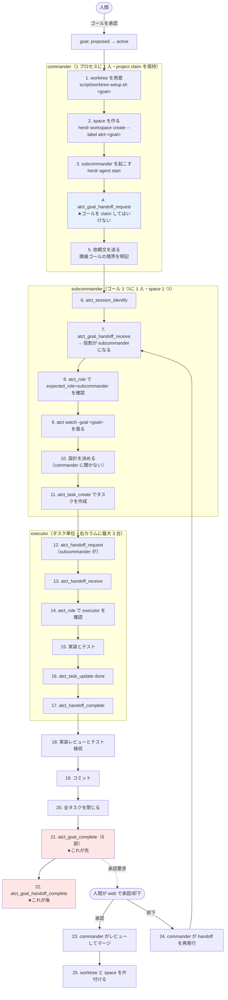
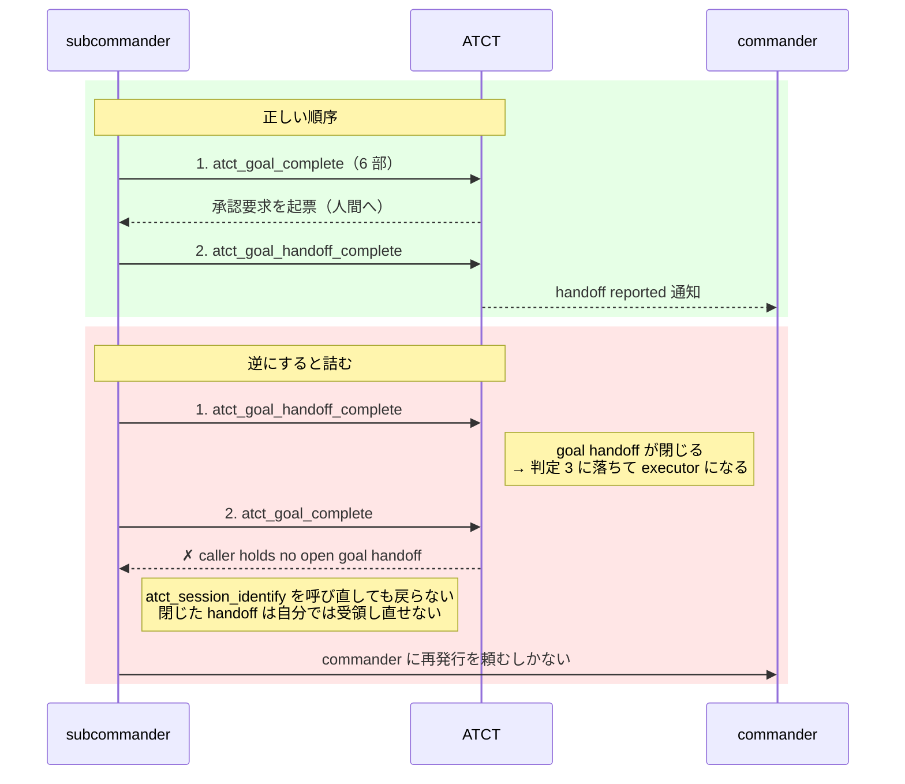
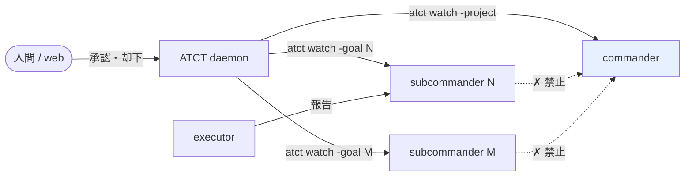

# 実行フロー: commander / subcommander / executor

**現状（2026-08-28、main `d58ba01`）の整理である。**出典は `skills/atct/SKILL.md` の
`## Roles` / `## Delegate a goal` / `## Delegate a task` / `## Report completion in six parts`。

**ゴール 192 がこのフローの変更を検討中である。**変わったらこの文書も更新する。

## 役割はどこから決まるか

**役割は宣言ではなく、claim と handoff の保有状態から daemon が導出する。**
`atct_role` が返す値であり、名乗りではない。

| 判定順 | 条件 | 役割 |
|---|---|---|
| 1 | プロジェクトの claim を保有している | `commander` |
| 2 | 受領済みで未完了の goal handoff を持ち、プロジェクト claim を持たない | `subcommander` |
| 3 | どちらでもない | `executor` |

**この順序が事故を生む。**subcommander が task handoff を受け取ると、
goal handoff と task handoff の両方を持つ。**判定 2 は「未完了の goal handoff」を見るので
subcommander のままだが、goal handoff を閉じた瞬間に判定 3 へ落ちて executor になる。**

## やること・やらないこと

| 層 | やること | やらないこと |
|---|---|---|
| `commander` | 受け入れ仕分け / ゴールの分割 / 作業場の用意 / 着地した変更のレビュー / 公開 / 衝突の解決 / 後片付け | ゴールの設計 / ゴールの実装 / executor の成果物の編集 |
| `subcommander` | ゴールの設計 / ゴールの作業の委譲 / 実装レビュー / **ゴールの完了報告** / 人間への決定の起票 / ゴールの作業のコミット / worker が閉じられないタスクを閉じる | 他のゴールを見る・管理する / 公開 / もう 1 人の subcommander を作る / プロジェクトを claim する |
| `executor` | 実装 / テスト / 渡されたタスクを閉じる | 設計判断 / 再委譲 / コミット / バージョン管理の内部詳細を書く |

## 全体フロー



## 順序を守らないと壊れるところ

### ① 委譲側はゴール／タスクを claim しない

**claim は open handoff を書き込む。**先に claim すると `atct_goal_handoff_request` が
「既に open な handoff がある」で必ず拒否される。

    commander が atct_goal_claim を呼ぶ
      -> 役割が subcommander に落ちる
      -> atct_goal_handoff_request が「project claim を持たない」で拒否される

**実測（2026-08-28）**: commander がゴール 199 でこれを踏んだ。`atct_goal_release` して
`atct_session_identify` を呼び直すまで委譲できなかった。

### ② `atct_goal_complete` が `atct_goal_handoff_complete` より先



**実測（2026-08-27〜28）**: 1 日で goal handoff の完了は 28 件、**再発行は約 25 件**。
**うち 15 件以上がこの順序違反である。**ゴール 180・184・187・146・188 が同じ形で詰まった。

**ゴール 194 が `## Delegate a goal` に手順 1〜4 と「Out of order」の代償を書き、
順序を崩すと `tests/wrapper_test.bash` が落ちるようにした（`d58ba01`）。**

### ③ 役割の確認は受領の後

`atct_role` は受領済み handoff から役割を導くので、**受領前に確認すると必ず
`matches: false` を返す。**

## 通知の流れ

**subcommander は commander に何も送らない**（ゴール 178 が塞いだ）。
両者は別々の watch で ATCT から直接受け取る。



| 粒度 | 誰に届くか | 根拠 |
|---|---|---|
| goal handoff の完了 | commander | 2026-08-27 に 28 件届き、**28 件すべてが行動に繋がった** |
| 人間の承認・却下 | 誰の watch にも届く | 34 件届き、全件が行動に繋がった |
| task handoff の完了 | subcommander のみ | commander には 63 件届いていたが、**行動に繋がったのは 0 件**。ゴール 184/185 が `-project` で絞った |
| 他人の決定の既定適用 | 出した本人のみ | commander に 11 件届いていたが、行動 0 件 |

## 作業場の対応関係

**ゴール 1 つに worktree 1 つ、space 1 つ、subcommander 1 人。**

```
ゴール N
 ├─ worktree  .worktrees/N            （ブランチ wt/goal-N）
 └─ space     atct-N
     ├─ 左 pane   atct-N-subcommander （Claude Code）
     └─ 右カラム  atct-N-executor     （Codex、最大 3 台）
```

- **commander は自分の space から動かない。**space を作る側であって、入る側ではない
- **space を閉じるのは承認のとき**であって、完了報告のときではない。却下されたら
  同じ space に同じゴールが戻る
- **`.worktrees/N/web/node_modules` は主チェックアウトへの symlink である。**
  pnpm を走らせるなら委譲側が先に `script/worktree-node-modules.sh detach` する
  （ゴール 191）

## 詰まったときの入口

| 症状 | 見るところ | 直し方 |
|---|---|---|
| ゴールが `active` のまま完了報告が空 | `select status, length(work_done) from goals where id=N` | commander が goal handoff を再発行 |
| `caller holds no open goal handoff` | `select completed_report_at from goal_handoffs where goal_id=N` | 同上。閉じた handoff は自分では受領し直せない |
| 役割が `executor` に落ちた | `atct_role` | 同じ session_key で `atct_session_identify` を呼び直す。**goal handoff を閉じた後は戻らない** |
| subcommander が黙って止まった | `herdr agent read <name>` | `API Error` / `went to sleep` を探す。ATCT からは検知できない（ゴール 182） |
| 通知が来なくなった | watch の Monitor | daemon 入れ替え後は張り直しが要る |
