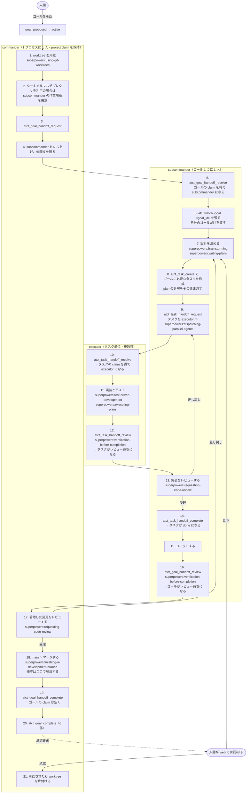
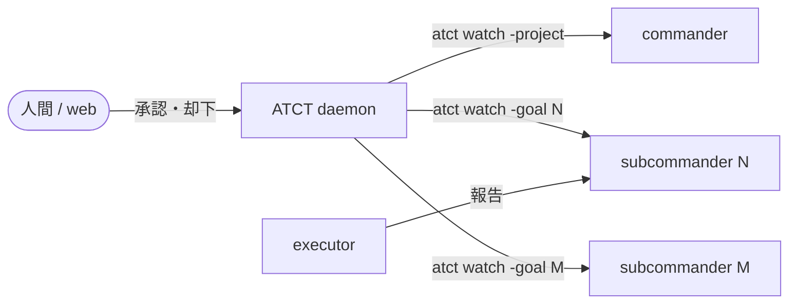

# 実行フロー: commander / subcommander / executor

**これは目標のフローであり、現状の記述ではない。**現状との差は「## 現状との差」に列挙する。
**この文書を元に実際のフローを直すゴールを立てる。**

**書き方**: 各層がやることだけを書く。やらないことは列挙しない。

## 設計の原則

この 4 つから、以下のすべてが導かれる。

1. **worktree が分離を担う。**ゴールごとに worktree が 1 つあるので、subcommander は
   自分のゴールだけを見て作業できる。**衝突はマージのときに commander が解決する。**
2. **順序は状態で守る。**間に合わない呼び出しが失敗し、失敗したら自力で回復できる。
3. **1 つの事実に 1 つの書き手。**同じことを 2 回呼ばせない。
4. **報告の宛先は 1 つ。**

## 層とその責務

| 層 | やること |
|---|---|
| `commander` | 受け入れ仕分け / ゴールの分割 / worktree の用意 / subcommander の起動 / **着地した変更のレビュー** / **ゴールの完了報告** / 衝突の解決 / 公開 / 後片付け |
| `subcommander` | ゴールの設計 / 作業の委譲 / 実装レビュー / コミット / 人間への決定の起票 |
| `executor` | 実装 / テスト / 渡されたタスクを閉じる |

**現状との最大の差は「ゴールの完了報告」が commander に移ることである。**
理由は「## なぜ完了報告を commander が書くのか」に書く。

## 役割はどこから決まるか

**役割は claim の保有状態から daemon が導出する。**`atct_role` が返す値である。

| 判定順 | 条件 | 役割 |
|---|---|---|
| 1 | プロジェクトの claim を保有 | `commander` |
| 2 | ゴールの claim を保有 | `subcommander` |
| 3 | タスクの claim を保有 | `executor` |

**ゴールの claim とは open な goal handoff の受領者であることである。**
`goals` に claim を保存する列は無い。`atct_goal_claim` は UUID の handoff を作って
自分で request し自分で receive する。`atct_goal_release` はそれを完了させる。

| 時点 | claim の持ち主 |
|---|---|
| 手順 3（request）の直後 | commander |
| 手順 5（receive）の後 | subcommander |
| 手順 19（commander が handoff complete）の後 | 誰も持たない |

`goal_handoffs` は 1 ゴールに open な行を 1 本だけ許す
（`idx_goal_handoffs_open_goal_id`）。**したがって委譲側は handoff を request する
ことでゴールを押さえる。**

## 全体フロー



**各 handoff が「レビュー待ち」を持つ。**作業した者が review を出し、
**渡した者が受理して閉じる。**

## superpowers はどこで使うか

**ATCT は「誰が何を持つか」を決め、superpowers は「その作業をどうやるか」を決める。**
両者は競合しない。

| 手順 | スキル |
|---|---|
| 1. worktree を用意 | `superpowers:using-git-worktrees` |
| 7. 設計を決める | `superpowers:brainstorming` → `superpowers:writing-plans` |
| 8. タスクを作成 | 7 で書いた plan の分解をそのまま `atct_task_create` に渡す |
| 9. タスクを executor へ | 2 つ以上を同時に出すなら `superpowers:dispatching-parallel-agents` |
| 11. 実装とテスト | `superpowers:test-driven-development`、plan があるなら `superpowers:executing-plans` |
| 12. review を出す前 | `superpowers:verification-before-completion` |
| 13. 実装をレビューする | `superpowers:requesting-code-review` |
| 16. ゴールの review を出す前 | `superpowers:verification-before-completion` |
| 17. 着地した変更をレビューする | `superpowers:requesting-code-review` |
| 18. main へマージする | `superpowers:finishing-a-development-branch` |

### 手順に紐づかないもの

- **差し戻しを受けた側**（14b で 9 に戻された executor、18b で 7 に戻された subcommander）は
  `superpowers:receiving-code-review` を使う
- **バグ・テスト失敗・想定外の挙動に遭遇したら、修正案を出す前に
  `superpowers:systematic-debugging` を使う。**これは全層に効く
- **設計文書は `doc/specs/`、実装計画は `doc/plans/` に置く。**
  superpowers の既定は `docs/superpowers/` だが、それを上書きする

### 12 と 16 に同じスキルが付く理由

`verification-before-completion` は「完了だと主張する前に検証を走らせる」ものである。
**review を出す行為が「完了だと主張する」に当たる。**executor がタスクについて、
subcommander がゴールについて、それぞれ同じことをする。

**2026-08-28 にゴール 185 は自分のブランチが赤いまま完了報告を出した。**
このスキルが 16 の位置にあれば、報告の前に落ちていた。

## handoff は 3 状態で動く

| 状態 | 誰が遷移させるか | ツール |
|---|---|---|
| 依頼 | 渡す側 | `atct_*_handoff_request` |
| 受領 | 作業する側 | `atct_*_handoff_receive` |
| **レビュー待ち** | **作業する側** | **`atct_*_handoff_review`** |
| 完了 | **渡した側** | `atct_*_handoff_complete` |

**作業した者は自分の handoff を閉じない。**閉じるのは受理した者である。

### タスクの場合

    executor       11. 実装とテスト
                   12. atct_task_handoff_review     -> tasks.status = 'review'
    subcommander   13. 実装をレビューする
                   14a. 受理  -> atct_task_handoff_complete  -> tasks.status = 'done'
                   14b. 差し戻し -> 9 に戻って atct_task_handoff_request

### ゴールの場合

    subcommander   15. コミットする
                   16. atct_goal_handoff_review     -> ゴールがレビュー待ち
    commander      17. 着地した変更をレビューする
                   18a. 受理  -> マージ -> atct_goal_handoff_complete -> atct_goal_complete
                   18b. 差し戻し -> subcommander が 7 から続ける

### これで再発行が要らなくなる

**現状は、作業した者が自分の handoff を閉じる。**閉じた瞬間に claim が空き、
役割が落ちるので、差し戻されても自分では受領し直せない。
**回復には commander が handoff を再発行するしかない。**

    2026-08-27〜28 の実測
      goal handoff の完了: 28 件
      commander による再発行: 約 25 件

**review を挟めば handoff は開いたままである。**差し戻しは「作業に戻る」だけで、
claim も役割も維持される。**再発行という操作そのものが不要になる。**

### 差し戻しの理由はどこに残るか

`complete_report` は受理のときに書かれる。**差し戻しの理由を書く場所が要る。**
handoff に `review_report`（作業した側が書く）と `reject_report`（渡した側が書く）を
置くか、`request_report` を再利用するかは実装で決める。

**executor の呼び出しは 3 つである**（receive / 実装 / review）。

## タスクは必ず executor に渡る

**subcommander はタスクを自分で持たない。**設計は手順 7 であってタスクではない。
**人間への決定は必要になった時点で `atct_decision_ask` を呼ぶもので、タスクではない。**

### 現状は役割違反の隠れ場所になっている

直近 120 タスクのうち、subcommander が立てて handoff を持たないものを数えた。

    $ sqlite3 ~/.atct/atct.db "
      select substr(t.title,1,55)
      from (select * from tasks order by id desc limit 120) t
      where not exists(select 1 from task_handoffs h where h.task_id=t.id)
        and t.agent like '%-subcommander';"

26 件あり、中身は 5 つに分かれた。

| 中身 | 件数 | 目標フローでの扱い |
|---|---|---|
| spec を書く | 4 | 設計（手順 7）に含む |
| 調査と実測 | 5 | executor へ渡す |
| 人間への決定 | 4 | `atct_decision_ask` を呼ぶ |
| レビュー | 1 | 手順 13 |
| **実装そのもの** | **12** | **executor へ渡す** |

**12 件は subcommander 自身の実装である。**役割表は subcommander に実装を割り当てて
いない。**「自分でやるタスク」という枠があったので、そこに紛れていた。**

    run.register に project を渡す経路を実装する
    JSON に 0 が出る経路を消し、httpapi と web を複数の親に追随させる
    tests/release_test.bash に .gitkeep 検査を足す
    自動再取得のために置かれた dirty 追跡を撤去する

**枠を無くせば、実装は executor に渡るしかなくなる。**

### これで全タスクが handoff を通る

差分 1（handoff の状態遷移がタスクの状態を書く）が全タスクに効くようになる。
**手で `atct_task_update` を呼ぶ経路が要らなくなる。**

## 1 つの事実に 1 つの書き手

### handoff の状態遷移がタスクの状態を書く

**`atct_task_handoff_review` が `tasks.status='review'` を、
`atct_task_handoff_complete` が `'done'` を書く。**

現状は `CompleteTaskHandoff` が `task_handoffs` の 2 列を書き、`tasks.status` を書くのは
`atct_task_update` である。**2 つが繋がっていないので片方だけ呼ばれる。**

    $ sqlite3 ~/.atct/atct.db "
      select t.id, t.goal_id, t.status, h.completed_report_at
      from task_handoffs h join tasks t on t.id=h.task_id
      where h.completed_report_at is not null and t.status <> 'done';"
    764|145|todo|2026-08-27T20:03:19
    788|146|todo|2026-08-28T04:52:21

handoff は閉じたのにタスクは `todo` で、ダッシュボードは「未着手」と表示する。
**この乖離を拾う検知は 13 種のうち 1 つも無い。**

**handoff の完了が両方を書けば、乖離が表現できなくなる。**

### セッション鍵は receive のときに ATCT が確定する

現状は各層が最初に `atct_session_identify` を呼ぶ。**呼び忘れが実データに残っている。**

    $ sqlite3 ~/.atct/atct.db "select count(*) from agent_sessions
      where session_key='' or session_key is null;"
    4260
    $ sqlite3 ~/.atct/atct.db "select count(*) from decisions d
      join agent_sessions s on s.id=d.agent_session_id
      where s.session_key='' or s.session_key is null;"
    160

**receive は誰が呼んだかを知っているので、そこで鍵を紐づける。**手順が 1 つ減る。

### receive が役割を返す

**receive が成功した時点で役割は確定している。**receive の応答が役割を含めば、
確認のための呼び出しが要らない。

`atct_role` は残す。**役割が壊れたときの診断に使う。**

## なぜ完了報告を commander が書くのか

**人間の指示（2026-08-28）**:

> 1. executor が task handoff complete
> 2. 全ての task handoff が完了したら subcommander が goal handoff complete
> 3. commander が goal 全体をレビュー後 goal 完了報告を提出
> 4. web 上でユーザーが承認したら commander が後片付けを行う

### レビューした者が報告を書く

現状は subcommander が報告を書き、commander がそれを読んでレビューする。
**書き手とレビュー者が別なので、commander は「報告が実物と合っているか」を
毎回確かめ直している。**2026-08-28 に landed 後の欠陥を 2 件見つけた
（ゴール 185 は自分のブランチが赤いまま完了報告を出していた）。

**レビューした者が報告を書けば、確かめ直しが 1 回で済む。**

### 増える負担は測ってから決める

人間は同日に commander のトークン消費を減らす方向も指示している。
**「最終レビュー」と「完了報告 6 部を書く」の量が同じかは測っていない。**
ゴール 192 がこれを判断する。

## 依頼書には自分のゴールのことだけを書く

**worktree が分離を担うので、依頼書は「このゴールの worktree で作業せよ」で足りる。**

### 衝突はマージのときに解決する

    $ git log --oneline --merges main --since='2026-08-28' | wc -l
    16        <- 本日のマージ
    衝突を解決したコミット: 1 件（ゴール 185 の cmd/atct/main.go）

**16 回のマージで衝突は 1 件で、commander が数分で解決した**
（ゴール 164 が消した行を、それより前に分岐した 185 が持っていた）。

境界を事前に書くには、委譲側が全 worktree の diff を測る必要がある。
**2026-08-28 に commander はこれを 2 回測り違え、194・183・191・146 の 4 者から
訂正された。**原因は `git diff` の既定 `-U3` がハンク見出しを変更箇所の 3 行前に
置くことだった。**起きた 1 件をマージ時に解決するほうが安い。**

### subcommander が main を取り込む

- **着手時と完了前に `git merge main` を自分で行う。**main が進んでいることは自分で確かめられる
- **衝突が自分の権限で解決できない形なら、commander へ返す**

## ゴールの取り下げは必ず届く

現状は、開いた決定を持たないゴールを取り下げるとイベントが流れない。

    // internal/store/goal.go の取り下げ処理
    if len(openDecisions) > 0 {
        s.notify.publishAll()
    }

取り下げの tx はタスクを全部 dropped にし、handoff を全部強制完了させる。
**担当していた subcommander に何も届かないので、その subcommander が起こした
executor は働き続ける。**

**取り下げは、開いた決定の有無にかかわらずイベントを流す。**subcommander の watch に
届き、subcommander が executor を止める。（ゴール 179 が扱っている）

## commander も判断を仰げる

現状の制約はこうである。

    CHECK (kind <> 'decision' OR status NOT IN ('open','answered')
           OR (task_id IS NOT NULL AND task_id <> ''))

開いている `decision` はタスクに紐づく必要がある。**commander はタスクを持たない
役割なので、この経路を使えない。**

2026-08-28 に 2 回ぶつかった。**公開の可否**（v0.60.0 をいま出すか）と
**ゴールの取り下げ可否**。どちらも取り消せない操作である。

**ゴールに紐づく決定を許す。**（ゴール 201 が扱う）

## 通知の宛先



**各層は自分の watch から ATCT の通知を直接受ける。**

| 粒度 | 届く先 | 根拠（2026-08-27 の実測） |
|---|---|---|
| goal handoff の完了 | commander | 28 件届き、**28 件すべてが行動に繋がった** |
| 人間の承認・却下 | 全層 | 34 件届き、全件が行動に繋がった |
| **ゴールの取り下げ** | そのゴールの subcommander | 現状は届かない（上記） |
| task handoff の完了 | そのゴールの subcommander | commander には 63 件届いていたが**行動 0 件** |
| 決定の既定適用 | その決定を出したセッション | commander に 11 件届いて**行動 0 件** |

## 作業場の対応関係

**ゴール 1 つに worktree 1 つ、subcommander 1 人。**

```
ゴール N
 └─ worktree  .worktrees/N   （ブランチ wt/goal-N）
     └─ subcommander 1 人 + そのゴールの executor
```

**エージェントをどう立ち上げるかは ATCT の管轄外である。**端末多重化ソフトの
使い方は orchestration スキルの側にある。

- **worktree を片付けるのは承認のとき。**却下されたら同じ worktree に同じゴールが戻る
- **`.worktrees/N/web/node_modules` は主チェックアウトへの symlink である。**
  pnpm を走らせるなら委譲側が先に `script/worktree-node-modules.sh detach` する

## 現状との差

**この文書が目標であり、以下はまだ実装されていない。**

| # | 差分 | 担当 |
|---|---|---|
| 0 | **handoff に「レビュー待ち」を足す** | **未着手** |
| 1 | handoff の状態遷移がタスクの状態を書く | **未着手** |
| 2 | セッション鍵は receive で確定する | **未着手** |
| 3 | receive が役割を返す | **未着手** |
| 4 | 完了報告を commander が書く | 192 |
| 5 | 依頼書は自分のゴールだけ | **未着手** |
| 6 | 取り下げが必ず届く | 179 |
| 7 | commander が決定を出せる | 201（proposed） |
| 8 | `atct_task_create` に改名 | 200 |
| 9 | タスク側の handoff ツールも粒度を名前に持つ | **未着手** |
| 10 | **全タスクが executor に渡る**（subcommander は自分のタスクを持たない） | **未着手** |

### 0. handoff に「レビュー待ち」を足す

**この差分が他のすべての前提になる。**

| | |
|---|---|
| **いま** | `task_handoffs` と `goal_handoffs` の列は `requested_at` / `received_at` / `completed_report_at` の 3 つだけ。**作業した者が `completed_report_at` を書いて自分の handoff を閉じる。**閉じると claim が空いて役割が落ちるので、差し戻されても自分では受領し直せない |
| **目標** | `atct_task_handoff_review` と `atct_goal_handoff_review` を足す。**作業した者が review を出し、渡した者が受理して complete する。**差し戻しは handoff を閉じないので、claim も役割も維持される |
| **放置すると** | 差し戻しごとに commander の再発行が要る。2026-08-27〜28 の実測で goal handoff の完了 28 件に対し**再発行が約 25 件** |
| **必要な変更** | `task_handoffs` / `goal_handoffs` に review の時刻と報告を持つ列を足す移行 / `TaskStatus`（`internal/domain/status.go:14`）に `review` を足す / MCP ツール 2 つを追加 / `internal/store/wakeup.go` に「review のまま動かない」検知 |
| **未解決** | **差し戻しの理由をどこに書くか。**`complete_report` は受理のときに書かれる。review の報告と差し戻しの理由を別の列にするか、`request_report` を再利用するか |
| **未解決** | **`goals.status` に `review` を持たせるか。**タスク側は `tasks.status` に持たせると人間に言われている。ゴール側は handoff だけに持たせても、ダッシュボードから見えるかを確かめる必要がある |

### 1. handoff の状態遷移がタスクの状態を書く

| | |
|---|---|
| **いま** | `CompleteTaskHandoff`（`internal/store/task_handoff.go:298`、SQL は `internal/store/queries/task.sql:205`）が `task_handoffs` の `completed_report_at` と `complete_report` だけを書く。`tasks.status` を書くのは `UpdateTask` 経由の `task.update`（`internal/daemon/handler.go:994`）のみ |
| **目標** | `atct_task_handoff_review` が `'review'` を、`atct_task_handoff_complete` が `'done'` を書く |
| **放置すると** | 片方だけ呼ばれた行が残る。実測 2 件（task 764 / 788）。**`internal/store/wakeup.go` の検知 13 種にこの乖離を拾うものが無い**ので、誰も気づかない |
| **検査** | review を出した直後にタスクが `review` でないなら落ちること。complete の直後に `done` でないなら落ちること。**逆に、`atct_task_update` 単体でも従来どおり閉じられること**（handoff を持たないタスクがあるため） |

### 2. セッション鍵は receive で確定する

| | |
|---|---|
| **いま** | 各層が最初に `atct_session_identify` を呼ぶ。`skills/atct/SKILL.md` に 5 か所、`skills/start/SKILL.md` に 2 か所その指示がある |
| **目標** | `ReceiveGoalHandoff`（`internal/store/goal_handoff.go:222`）と `ReceiveTaskHandoff`（`internal/store/task_handoff.go:225`）が呼び手の鍵を確定する。手順から 1 つ消える |
| **放置すると** | 空鍵のセッションが積み上がる。`agent_sessions` に 4,260 行、**うち 160 行は決定を出している。**役割が導出できず、commander が 2026-08-28 に 3 回「役割が executor に落ちた」を踏んだ |
| **未解決** | **鍵の値をどこから取るか。**呼び手のプロセス情報からか、request 側が渡すか。`atct_session_identify` を残すか消すかもここで決まる |

### 3. receive が役割を返す

| | |
|---|---|
| **いま** | receive の直後に `atct_role` を `expected_role` 付きで呼ばせる（`skills/atct/SKILL.md:257` と `:390`） |
| **目標** | receive の応答に役割を含める。確認のための往復が消える |
| **放置すると** | 手順が 1 つ増えたままで、`matches: false` を見落とすと役割の合わない層が作業を始める |
| **注意** | **`atct_role` 自体は残す。**役割が壊れたときの診断に要る。手順から外すだけである |

### 4. 完了報告を commander が書く

| | |
|---|---|
| **いま** | subcommander が `atct_goal_complete` → `atct_goal_handoff_complete` の順で呼ぶ |
| **目標** | subcommander は `atct_goal_handoff_review` を出す。commander がレビュー後に `atct_goal_handoff_complete` と `atct_goal_complete` を出す |
| **放置すると** | 書き手とレビュー者が別なので、commander が報告と実物の一致を毎回確かめ直す。2026-08-28 に landed 後の欠陥を 2 件見つけた |
| **未解決** | **commander の負担が増える量。**人間は同日に commander のトークン消費を減らす方向も指示している。192 が判断する |

### 5. 依頼書は自分のゴールだけ

| | |
|---|---|
| **いま** | `skills/atct/SKILL.md:377` が「Name in the request every adjacent goal that touches the same files and say which side owns what」と要求する |
| **目標** | その要求を落とす。依頼書は「このゴールの worktree で作業せよ」で足りる |
| **放置すると** | 委譲側が毎回全 worktree の diff を測る。**2026-08-28 に commander は 2 回測り違え、194・183・191・146 の 4 者から訂正された**（原因は `git diff` の既定 `-U3`）。防いでいる衝突は 16 マージに 1 件 |
| **合わせて** | subcommander が着手時と完了前に `git merge main` を自分で行う手順を書く。**衝突が自分の権限で解決できない形なら commander へ返す** |

### 6. 取り下げが必ず届く

| | |
|---|---|
| **いま** | `WithdrawActiveGoal`（`internal/store/goal.go:636`）が `if len(openDecisions) > 0`（`:714`）で publish を門にしている。決定が 0 件なら素通りする |
| **目標** | 決定の有無にかかわらずイベントを流す。担当 subcommander の watch に届く |
| **放置すると** | タスクは全部 dropped、handoff は全部強制完了なのに、**subcommander は無音で、その executor は働き続ける** |
| **注意** | `internal/httpapi/server.go` の `eventMatchesGoalID` は通す型を絞っている。**新しい型を足すならそこに case を足さないと `-goal` 指定の watch では落ちる** |

### 7. commander が決定を出せる

| | |
|---|---|
| **いま** | `CHECK (kind <> 'decision' OR status NOT IN ('open','answered') OR (task_id IS NOT NULL AND task_id <> ''))`。`0001_baseline.sql:79` から入り、`0019_integer_agent_session_ids.sql:62` に引き継がれている |
| **目標** | ゴールに紐づく決定を許す。commander が公開や取り下げの可否を起票できる |
| **放置すると** | commander は取り消せない操作を会話で聞くしかない。2026-08-28 に 2 回起きた（v0.60.0 の公開可否、ゴール 173 の取り下げ可否） |
| **未解決** | **baseline がこの制約を置いた理由。**`kind='decision'` だけが縛られ、`completion` と `goal_approval` は task_id 無しで通っている（2026-08-29 時点でそれぞれ 226 件 / 123 件）。**理由を調べてから緩めるか、制約を残して別経路を作るかを決める** |

### 8. `atct_task_create` に改名

| | |
|---|---|
| **いま** | `atct_task_declare`。declare は「作業前に人間へ表明する」という規範を名前に背負わせたもので、その規範は `skills/atct/SKILL.md` の `## Declare before you work` 側に残る |
| **目標** | `atct_task_create`。応答も `created` |
| **状況** | ゴール 200 が実装済み。人間が「旧名は残さないで」と却下したため、非推奨エイリアスを消す作業が進行中 |

### 9. タスク側の handoff ツールも粒度を名前に持つ

| | |
|---|---|
| **いま** | ゴール側は `atct_goal_handoff_request` / `_receive` / `_complete` / `_report_amend`、タスク側は `atct_handoff_*`（`internal/mcpshim/tools.go:618` / `:629` / `:643` / `:657`）。**タスク側だけ粒度が名前に無い** |
| **目標** | `atct_task_handoff_*` に揃える |
| **放置すると** | 読む側が「どちらの handoff か」を文脈から補う。8 と同じ種類の問題である |
| **注意** | **短い名前が長い名前の中に一致する。**`atct_handoff_complete` は `atct_goal_handoff_complete` の部分文字列なので、置換と検査はバックティックで囲んで区切る |

### 10. 全タスクが executor に渡る

| | |
|---|---|
| **いま** | 直近 120 タスクのうち subcommander が立てて handoff を持たないものが 26 件あり、**うち 12 件は subcommander 自身の実装である。**役割表は subcommander に実装を割り当てていない |
| **目標** | subcommander はタスクを持たない。設計は手順 7、人間への決定は `atct_decision_ask`、レビューは手順 13 で、いずれもタスクではない |
| **放置すると** | 役割違反が「自分でやるタスク」の枠に紛れる。差分 1 も 24% のタスクに効かない |
| **合わせて** | ゴール 177（`atct_task_claim` の自己 handoff がスキルの委譲手順を実行不能にする）は、**全タスクが handoff を通るなら自己 claim の経路そのものが不要になる。**177 の扱いをここで決める |

### ゴール完了の門番はこのままにする

    $ sqlite3 ~/.atct/atct.db "
      select count(*) from goals g where g.status='done'
      and exists(select 1 from tasks t where t.goal_id=g.id
                 and t.status in ('todo','doing'));"
    0
    （done なゴールの総数は 130）

**130 回すべて、未完了タスクを残さずに完了している。**この数字から門番を足す
理由は出てこない。handoff の完了がタスクを閉じるようになれば、
手で閉じる対象は自分でやったタスクだけに縮む。
