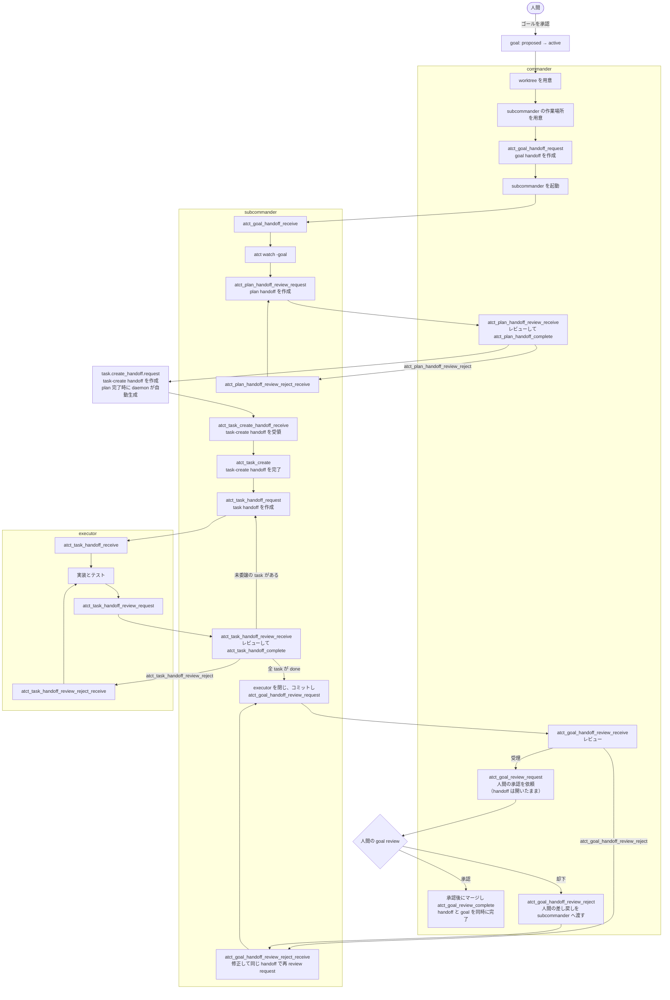

# 実行フロー: commander / subcommander / executor

ATCT の実行フローである。各層はここに定めた責務と handoff の状態遷移に従う。

## 設計の原則

1. **worktree が分離を担う。**ゴールごとに worktree を 1 つ持ち、衝突は main への
   マージ時に commander が解決する。
2. **順序は状態で守る。**通常の順序違反は状態遷移で拒否し、復旧可能な失敗はその状態から
   回復する。
3. **1 つの事実に 1 つの書き手を置く。**handoff の受理記録と、goal の完成報告は
   保存先と目的が異なる事実として扱う。
4. **実装は executor が行う。**subcommander は設計・委譲・レビュー・決定を担い、
   実装タスクを自分で実行しない。

## 層と責務

| 層 | やること |
|---|---|
| `commander` | ゴールの分割、worktree の用意、subcommander の起動と終了、設計とゴール変更のレビュー、最終報告、マージ、公開、後片付け |
| `subcommander` | ゴールの設計、executor へのタスク委譲、executor の起動と終了、実装レビュー、ゴール内のコミット、人間への決定の起票 |
| `executor` | 受領したタスクの実装、テスト、レビュー依頼 |

## 役割とセッション

`atct_role` は daemon が handoff/claim の保有状態から導出する役割を返す。

| 判定順 | 条件 | 役割 |
|---|---|---|
| 1 | project claim を保有 | `commander` |
| 2 | 受領済みで未完了の goal handoff を保有 | `subcommander` |
| 3 | 受領済みで未完了の task handoff を保有 | `executor` |

task claim/release は agent 向けの MCP/RPC として公開しない。実装の所有権は、
subcommander が request し executor が receive した task handoff で表す。

task/goal handoff を receive する worker は、SessionStart の正確な `session_key` を渡す。
`monitor_token` が発行されている場合は併せて渡す。MCP shim は receive の前にその鍵で
canonical な agent session を確定し、receive は role と claim evidence を返す。
`atct_role` は継続作業の前提ではなく、役割異常の診断に使う。

## handoff の状態

| 状態 | 遷移させる者 | `goal` | `plan` | `task` |
|---|---|---|---|---|
| 依頼 | 渡す側 | `atct_goal_handoff_request` | — | `atct_task_handoff_request` |
| 受領 | 作業する側 | `atct_goal_handoff_receive` | — | `atct_task_handoff_receive` |
| レビュー依頼 | 作業する側 | `atct_goal_handoff_review_request` | `atct_plan_handoff_review_request` | `atct_task_handoff_review_request` |
| レビュー受領 | レビューする側 | `atct_goal_handoff_review_receive` | `atct_plan_handoff_review_receive` | `atct_task_handoff_review_receive` |
| 完了 | 渡した側 | `atct_goal_review_complete`（人間承認後） | `atct_plan_handoff_complete` | `atct_task_handoff_complete` |
| 差し戻し | 渡した側 | `atct_goal_handoff_review_reject` | `atct_plan_handoff_review_reject` | `atct_task_handoff_review_reject` |
| 差し戻し受領 | 作業する側 | `atct_goal_handoff_review_reject_receive` | `atct_plan_handoff_review_reject_receive` | `atct_task_handoff_review_reject_receive` |

| handoff | 誰から誰へ | レビューする者 |
|---|---|---|
| `goal` | commander → subcommander | commander |
| `plan` | subcommander → commander | commander |
| `task` | subcommander → executor | subcommander |

`plan` は設計成果物を上位層へ渡すため、request/receive を持たず review request から始まる。
作業した側は自身の handoff を閉じない。差し戻しは handoff を閉じず、受領済みの状態へ
戻すため、作業者は同じ handoff で修正と再レビューを行う。

### task-create handoff

plan handoff の完了時に、daemon は `task.create_handoff.request` を自動生成する。
agent が呼ぶ `atct_task_handoff_create_request` は存在しない。goal handoff を受領している
subcommander が `atct_task_create_handoff_receive` でこの handoff を受領し、同じ
`handoff_id` を渡した `atct_task_create` で task を作成して handoff を完了する。

## タスクの状態遷移

通常の実装フローでは handoff 遷移が task status を更新する。

| handoff の遷移 | `tasks.status` |
|---|---|
| `atct_task_handoff_request` | `todo` |
| `atct_task_handoff_receive` | `doing` |
| `atct_task_handoff_review_request` | `review` |
| `atct_task_handoff_complete` | `done` |
| `atct_task_handoff_review_reject` | `doing` |

## 全体フロー

### commander

1. ゴールごとの worktree を用意する。
2. subcommander の作業場所を用意し、`atct_goal_handoff_request` を記録してから起動する。
3. plan review の通知を受けたら `atct_plan_handoff_review_receive` で受領して設計を
   レビューし、受理なら `atct_plan_handoff_complete`、差し戻しなら
   `atct_plan_handoff_review_reject` を呼ぶ。
4. goal review の通知を受けたら `atct_goal_handoff_review_receive` で受領してレビューする。
   差し戻す場合は `atct_goal_handoff_review_reject` を呼ぶ。受理した handoff は開いたままにし、
   人間の review へ進める。
5. `atct_goal_review_request` で人間の review を依頼する。承認後に main へマージして
   `atct_goal_review_complete` を呼ぶ。この操作は goal handoff と goal を同じ transaction で
   完了し、worktree と subcommander を片付ける。
6. 人間が却下した場合は、通知を受けた commander がフィードバックを添えて
   `atct_goal_handoff_review_reject` を呼ぶ。新しい handoff は作らない。

### subcommander

1. `atct_goal_handoff_receive` に SessionStart の `session_key` と必要なら
   `monitor_token` を渡して、goal を受領する。
2. `atct watch -goal <goal_id>` を開始する。
3. `superpowers:brainstorming` と `superpowers:writing-plans` で設計し、
   canonical spec と plan を `atct_goal_update_request_report` へ保存して
   `atct_plan_handoff_review_request` で plan handoff を作成する。
   差し戻しを受けた場合は `atct_plan_handoff_review_reject_receive` を呼んでから、
   同じ `handoff_id` で `atct_plan_handoff_review_request` を呼び、修正した plan の
   review を再開する。この遷移は既存の plan handoff を再利用し、新しい handoff は作らない。
4. plan handoff の完了で生成された task-create handoff を
   `atct_task_create_handoff_receive` で受領し、その `handoff_id` を渡して
   `atct_task_create` で task を作る。
5. task ごとに `atct_task_handoff_request` を記録してから executor を起動する。
6. executor の review request を受領してレビューし、受理なら
   `atct_task_handoff_complete`、差し戻しなら `atct_task_handoff_review_reject` を呼ぶ。
7. 全 task が done になったら executor を閉じ、変更をコミットし、
   `atct_goal_handoff_review_request` を出す。
8. goal handoff が差し戻された場合は
   `atct_goal_handoff_review_reject_receive` を呼び、修正後に同じ `handoff_id` で
   `atct_goal_handoff_review_request` を出す。

### executor

1. `atct_task_handoff_receive` に SessionStart の `session_key` と必要なら
   `monitor_token` を渡して、渡された task を受領する。
2. `superpowers:test-driven-development` に従って実装とテストを行う。
3. `superpowers:verification-before-completion` の検証後、
   `atct_task_handoff_review_request` を出す。
4. 差し戻された場合は `atct_task_handoff_review_reject_receive` を呼び、同じ task
   handoff で修正して再び review request を出す。

## 人間のレビュー

`atct_goal_review_*` は handoff のレビューではなく、ゴールそのもののレビューである。
commander は goal handoff の review を受領してから human review を依頼する。その間 handoff は
開いたままであり、承認後の `atct_goal_review_complete` が main へのマージ後に handoff と goal を
同時に完了する。人間の却下は handoff の差し戻しへ変換され、同じ handoff で作業を再開する。

## 通知

各層は自身の watch から通知を直接受ける。レビューと再開は通知で始める。

| イベント | 呼ぶ者 | 届く先 |
|---|---|---|
| `atct_plan_handoff_review_request` | subcommander | commander |
| `atct_plan_handoff_complete` / `_review_reject` | commander | subcommander |
| `task.create_handoff.request` | daemon（plan handoff 完了時） | subcommander |
| `atct_task_handoff_review_request` | executor | subcommander |
| `atct_task_handoff_complete` / `_review_reject` | subcommander | executor |
| `atct_goal_handoff_review_request` | subcommander | commander |
| `goal.handoff.complete` | daemon（`atct_goal_review_complete` 時） | subcommander |
| `atct_goal_handoff_review_reject` | commander | subcommander |
| `atct_goal_review_reject` | 人間 | commander（`goal.review.reject` 通知） |
| `atct_goal_review_complete` | commander（人間の承認後） | — |
| ゴールの取り下げ | commander | そのゴールの subcommander |

## worktree とコミット

- ゴール 1 つに worktree 1 つ、subcommander 1 人を対応させる。
- subcommander は着手時と goal review の前に `git merge main` を行う。権限内で
  解決できない衝突は commander へ返す。
- executor を閉じる前に、未コミットの変更がなく、task review の結果が記録済みであることを
  確認する。
- 人間の承認後に commander が main へマージし、worktree を片付ける。
