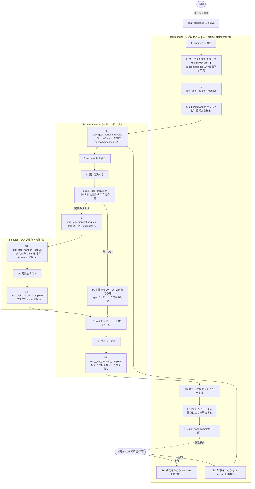
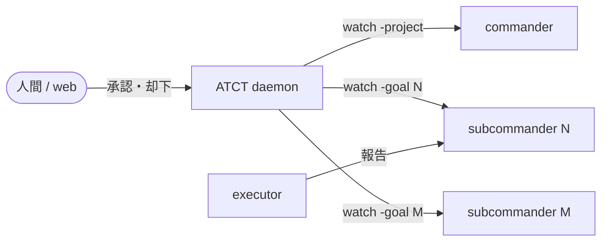

# 実行フロー: commander / subcommander / executor

**これは目標のフローであり、現状の記述ではない。**現状との差は「## 現状との差」に列挙する。
**この文書を元に実際のフローを直すゴールを立てる。**

**書き方**: 各層がやることだけを書く。やらないことは列挙しない。

## 設計の原則

この 4 つから、以下のすべてが導かれる。

1. **worktree が分離を担う。**ゴールごとに worktree が 1 つあるので、subcommander は
   自分のゴールだけを見て作業できる。**衝突はマージのときに commander が解決する。**
2. **順序は状態で守る。**間に合わない呼び出しが失敗し、失敗したら自力で回復できる。
3. **1 つの事実に 1 つの書き手。**同じことを 2 回呼ばせない。
4. **報告の宛先は 1 つ。**

## 層とその責務

| 層 | やること |
|---|---|
| `commander` | 受け入れ仕分け / ゴールの分割 / worktree の用意 / subcommander の起動 / **着地した変更のレビュー** / **ゴールの完了報告** / 衝突の解決 / 公開 / 後片付け |
| `subcommander` | ゴールの設計 / 作業の委譲 / 実装レビュー / コミット / 人間への決定の起票 |
| `executor` | 実装 / テスト / 渡されたタスクを閉じる |

**現状との最大の差は「ゴールの完了報告」が commander に移ることである。**
理由は「## なぜ完了報告を commander が書くのか」に書く。

## 役割はどこから決まるか

**役割は claim の保有状態から daemon が導出する。**`atct_role` が返す値である。

| 判定順 | 条件 | 役割 |
|---|---|---|
| 1 | プロジェクトの claim を保有 | `commander` |
| 2 | ゴールの claim を保有 | `subcommander` |
| 3 | タスクの claim を保有 | `executor` |

**ゴールの claim とは open な goal handoff の受領者であることである。**
`goals` に claim を保存する列は無い。`atct_goal_claim` は UUID の handoff を作って
自分で request し自分で receive する。`atct_goal_release` はそれを完了させる。

| 時点 | claim の持ち主 |
|---|---|
| 手順 3（request）の直後 | commander |
| 手順 5（receive）の後 | subcommander |
| 手順 15（handoff complete）の後 | 誰も持たない |

`goal_handoffs` は 1 ゴールに open な行を 1 本だけ許す
（`idx_goal_handoffs_open_goal_id`）。**したがって委譲側は handoff を request する
ことでゴールを押さえる。**

## 全体フロー



**executor の手順が 6 つから 3 つに減っている。**理由は次節。

## 1 つの事実に 1 つの書き手

### `atct_task_handoff_complete` がタスクを閉じる

現状は `CompleteTaskHandoff` が `task_handoffs` の 2 列を書き、`tasks.status` を書くのは
`atct_task_update` である。**2 つが繋がっていないので片方だけ呼ばれる。**

    $ sqlite3 ~/.atct/atct.db "
      select t.id, t.goal_id, t.status, h.completed_report_at
      from task_handoffs h join tasks t on t.id=h.task_id
      where h.completed_report_at is not null and t.status <> 'done';"
    764|145|todo|2026-08-27T20:03:19
    788|146|todo|2026-08-28T04:52:21

handoff は閉じたのにタスクは `todo` で、ダッシュボードは「未着手」と表示する。
**この乖離を拾う検知は 13 種のうち 1 つも無い。**

**handoff の完了が両方を書けば、乖離が表現できなくなる。**

### セッション鍵は receive のときに ATCT が確定する

現状は各層が最初に `atct_session_identify` を呼ぶ。**呼び忘れが実データに残っている。**

    $ sqlite3 ~/.atct/atct.db "select count(*) from agent_sessions
      where session_key='' or session_key is null;"
    4260
    $ sqlite3 ~/.atct/atct.db "select count(*) from decisions d
      join agent_sessions s on s.id=d.agent_session_id
      where s.session_key='' or s.session_key is null;"
    160

**receive は誰が呼んだかを知っているので、そこで鍵を紐づける。**手順が 1 つ減る。

### receive が役割を返す

**receive が成功した時点で役割は確定している。**receive の応答が役割を含めば、
確認のための呼び出しが要らない。

`atct_role` は残す。**役割が壊れたときの診断に使う。**

## なぜ完了報告を commander が書くのか

**人間の指示（2026-08-28）**:

> 1. executor が task handoff complete
> 2. 全ての task handoff が完了したら subcommander が goal handoff complete
> 3. commander が goal 全体をレビュー後 goal 完了報告を提出
> 4. web 上でユーザーが承認したら commander が後片付けを行う

### 順序の罠が構造ごと消える

現状は subcommander が `atct_goal_complete` → `atct_goal_handoff_complete` の順で呼ぶ。
**逆順だと goal handoff が閉じて役割が落ち、`atct_goal_complete` が拒否され、
閉じた handoff は自分では受領し直せない。**

    2026-08-27〜28 の実測
      goal handoff の完了: 28 件
      commander による再発行: 約 25 件
      うち 15 件以上がこの順序違反

**subcommander が `atct_goal_complete` を呼ばない形にすれば、この経路は存在しない。**

### レビューした者が報告を書く

現状は subcommander が報告を書き、commander がそれを読んでレビューする。
**書き手とレビュー者が別なので、commander は「報告が実物と合っているか」を
毎回確かめ直している。**2026-08-28 に landed 後の欠陥を 2 件見つけた
（ゴール 185 は自分のブランチが赤いまま完了報告を出していた）。

**レビューした者が報告を書けば、確かめ直しが 1 回で済む。**

### 増える負担は測ってから決める

人間は同日に commander のトークン消費を減らす方向も指示している。
**「最終レビュー」と「完了報告 6 部を書く」の量が同じかは測っていない。**
ゴール 192 がこれを判断する。

## 依頼書には自分のゴールのことだけを書く

**worktree が分離を担うので、依頼書は「このゴールの worktree で作業せよ」で足りる。**

### 衝突はマージのときに解決する

    $ git log --oneline --merges main --since='2026-08-28' | wc -l
    16        <- 本日のマージ
    衝突を解決したコミット: 1 件（ゴール 185 の cmd/atct/main.go）

**16 回のマージで衝突は 1 件で、commander が数分で解決した**
（ゴール 164 が消した行を、それより前に分岐した 185 が持っていた）。

境界を事前に書くには、委譲側が全 worktree の diff を測る必要がある。
**2026-08-28 に commander はこれを 2 回測り違え、194・183・191・146 の 4 者から
訂正された。**原因は `git diff` の既定 `-U3` がハンク見出しを変更箇所の 3 行前に
置くことだった。**起きた 1 件をマージ時に解決するほうが安い。**

### subcommander が main を取り込む

- **着手時と完了前に `git merge main` を自分で行う。**main が進んでいることは自分で確かめられる
- **衝突が自分の権限で解決できない形なら、commander へ返す**

## ゴールの取り下げは必ず届く

現状は、開いた決定を持たないゴールを取り下げるとイベントが流れない。

    // internal/store/goal.go の取り下げ処理
    if len(openDecisions) > 0 {
        s.notify.publishAll()
    }

取り下げの tx はタスクを全部 dropped にし、handoff を全部強制完了させる。
**担当していた subcommander に何も届かないので、その subcommander が起こした
executor は働き続ける。**

**取り下げは、開いた決定の有無にかかわらずイベントを流す。**subcommander の watch に
届き、subcommander が executor を止める。（ゴール 179 が扱っている）

## commander も判断を仰げる

現状の制約はこうである。

    CHECK (kind <> 'decision' OR status NOT IN ('open','answered')
           OR (task_id IS NOT NULL AND task_id <> ''))

開いている `decision` はタスクに紐づく必要がある。**commander はタスクを持たない
役割なので、この経路を使えない。**

2026-08-28 に 2 回ぶつかった。**公開の可否**（v0.60.0 をいま出すか）と
**ゴールの取り下げ可否**。どちらも取り消せない操作である。

**ゴールに紐づく決定を許す。**（ゴール 201 が扱う）

## 通知の宛先



**各層は自分の watch から ATCT の通知を直接受ける。**

| 粒度 | 届く先 | 根拠（2026-08-27 の実測） |
|---|---|---|
| goal handoff の完了 | commander | 28 件届き、**28 件すべてが行動に繋がった** |
| 人間の承認・却下 | 全層 | 34 件届き、全件が行動に繋がった |
| **ゴールの取り下げ** | そのゴールの subcommander | 現状は届かない（上記） |
| task handoff の完了 | そのゴールの subcommander | commander には 63 件届いていたが**行動 0 件** |
| 決定の既定適用 | その決定を出したセッション | commander に 11 件届いて**行動 0 件** |

## 作業場の対応関係

**ゴール 1 つに worktree 1 つ、subcommander 1 人。**

```
ゴール N
 └─ worktree  .worktrees/N   （ブランチ wt/goal-N）
     └─ subcommander 1 人 + そのゴールの executor
```

**エージェントをどう立ち上げるかは ATCT の管轄外である。**端末多重化ソフトの
使い方は orchestration スキルの側にある。

- **worktree を片付けるのは承認のとき。**却下されたら同じ worktree に同じゴールが戻る
- **`.worktrees/N/web/node_modules` は主チェックアウトへの symlink である。**
  pnpm を走らせるなら委譲側が先に `script/worktree-node-modules.sh detach` する

## 現状との差

**この文書が目標であり、以下はまだ実装されていない。**

| 節 | 差分 | 扱っているゴール |
|---|---|---|
| handoff の完了がタスクを閉じる | 現状は 2 回呼ぶ。乖離 2 件、検知なし | **未着手** |
| セッション鍵は receive で確定する | 現状は各層が呼ぶ。空鍵 4,260 行 / 決定 160 件 | **未着手** |
| receive が役割を返す | 現状は receive 後に `atct_role` を呼ぶ | **未着手** |
| 完了報告を commander が書く | 現状は subcommander。再発行 25 件の原因 | 192 |
| 依頼書は自分のゴールだけ | 現状は隣接ゴールを名指しする | **未着手** |
| 取り下げが必ず届く | 現状は決定 0 件だと無音 | 179 |
| commander が決定を出せる | 現状は CHECK 制約で不可 | 201（proposed） |
| `atct_task_create` | 現状は `atct_task_declare` | 200 |
| タスク側の handoff ツールも粒度を名前に持つ | 現状は `atct_handoff_*`（ゴール側は `atct_goal_handoff_*`）。名前が対象を表していない | **未着手** |
| 自分でやるタスクにも claim を通す | 現状は handoff を持たない（直近 100 件中 24 件） | 177（proposed） |

### ゴール完了の門番はこのままにする

    $ sqlite3 ~/.atct/atct.db "
      select count(*) from goals g where g.status='done'
      and exists(select 1 from tasks t where t.goal_id=g.id
                 and t.status in ('todo','doing'));"
    0
    （done なゴールの総数は 130）

**130 回すべて、未完了タスクを残さずに完了している。**この数字から門番を足す
理由は出てこない。handoff の完了がタスクを閉じるようになれば、
手で閉じる対象は自分でやったタスクだけに縮む。
