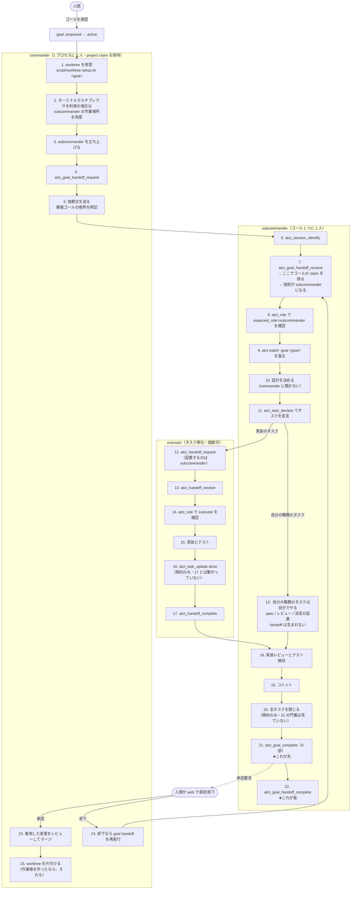
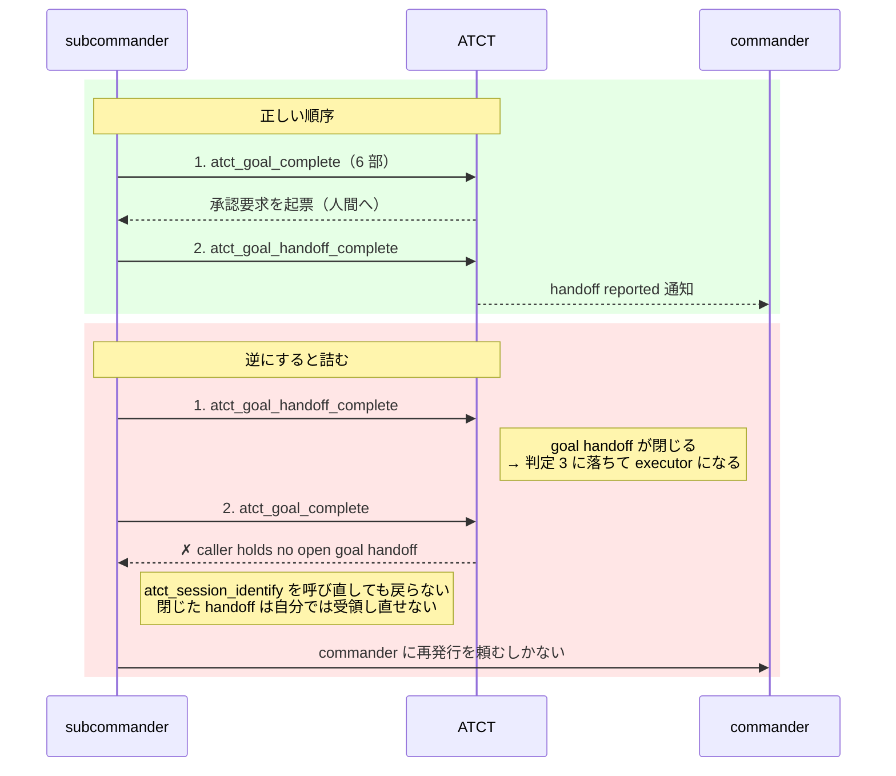
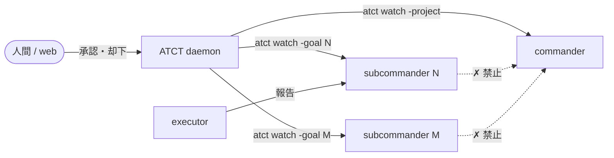

# 実行フロー: commander / subcommander / executor

**現状（2026-08-28、main `d58ba01`）の整理である。**出典は `skills/atct/SKILL.md` の
`## Roles` / `## Delegate a goal` / `## Delegate a task` / `## Report completion in six parts`。

**ゴール 192 がこのフローの変更を検討中である。**変わったらこの文書も更新する。

## ゴールの claim とは open な goal handoff のことである

**`goals` に claim を保存する列は無い。**

    $ sqlite3 ~/.atct/atct.db "select name from pragma_table_info('goals');"
    id project_id derived_from_goal_id content status creator result_summary
    work_done now_possible how_to_verify surprises needs_review next_steps
    created_at updated_at

**ゴールの claim とは「open な goal handoff の受領者であること」そのものである。**
`ClaimGoal`（`internal/store/goal.go:183`）は UUID の handoff を作り、自分で request して
自分で receive するだけである。

    handoffID := uuid.NewString()
    s.reclaimOpenGoalHandoff(ctx, handoffID, goalID)
    s.requestGoalHandoffForClaim(ctx, handoffID, goalID, agentSessionID)
    s.ReceiveGoalHandoff(ctx, handoffID, goalID, agentSessionID)

`ReleaseGoal` も対称で、open な handoff を完了させるだけである。

したがって claim の持ち主はこう推移する。

| 時点 | `requested_by` | `received_by` | claim の持ち主 |
|---|---|---|---|
| 手順 4 の直後 | commander | 0 | **commander** |
| 手順 7 の後 | commander | subcommander | **subcommander** |
| 手順 22 の後 | commander | subcommander | **誰も持たない**（handoff が閉じた） |

**「claim が移る」のではなく、`received_by` が埋まることが claim の移動である。**

`goal_handoffs` には open な行を 1 ゴールに 1 本しか許さない UNIQUE 制約がある。

    CREATE UNIQUE INDEX idx_goal_handoffs_open_goal_id
      ON goal_handoffs(goal_id) WHERE completed_report_at IS NULL;

**これが手順 4 で claim してはいけない理由である。**先に `atct_goal_claim` を呼ぶと
自分名義の open handoff ができ、続く `atct_goal_handoff_request` が制約で弾かれる。

## 役割はどこから決まるか

**役割は宣言ではなく、claim と handoff の保有状態から daemon が導出する。**
`atct_role` が返す値であり、名乗りではない。

| 判定順 | 条件 | 役割 |
|---|---|---|
| 1 | プロジェクトの claim を保有している | `commander` |
| 2 | 受領済みで未完了の goal handoff を持ち、プロジェクト claim を持たない | `subcommander` |
| 3 | どちらでもない | `executor` |

**この順序が事故を生む。**subcommander が task handoff を受け取ると、
goal handoff と task handoff の両方を持つ。**判定 2 は「未完了の goal handoff」を見るので
subcommander のままだが、goal handoff を閉じた瞬間に判定 3 へ落ちて executor になる。**

## やること・やらないこと

| 層 | やること | やらないこと |
|---|---|---|
| `commander` | 受け入れ仕分け / ゴールの分割 / 作業場の用意 / 着地した変更のレビュー / 公開 / 衝突の解決 / 後片付け | ゴールの設計 / ゴールの実装 / executor の成果物の編集 |
| `subcommander` | ゴールの設計 / ゴールの作業の委譲 / 実装レビュー / **ゴールの完了報告** / 人間への決定の起票 / ゴールの作業のコミット / worker が閉じられないタスクを閉じる | 他のゴールを見る・管理する / 公開 / もう 1 人の subcommander を作る / プロジェクトを claim する |
| `executor` | 実装 / テスト / 渡されたタスクを閉じる | 設計判断 / 再委譲 / コミット / バージョン管理の内部詳細を書く |

## 全体フロー



## レビューとコミットは executor がやらない

**手順 18（実装レビューとテスト検収）と 19（コミット）は subcommander の仕事である。**
役割表がそう決めている。

    subcommander の does      review implementation / commit the goal's work
    executor の does_not      commit / write internal version-control details

**executor は実装してテストを通し、タスクを閉じて報告するところまでで終わる。**
成果をコミットするのは、それをレビューした subcommander である。**executor が
コミットすると、レビューを通っていない変更がブランチに乗る。**

これは 12' の経路と同じ理由で handoff を持たない。**subcommander が自分でやる仕事なので、
渡す相手がいない。**

## タスクは必ず executor に渡るわけではない

**subcommander は自分の職務をタスクとして立て、自分で閉じる。**これは違反ではなく、
役割表の `does` にある仕事である（`review implementation` / `commit the goal's work` /
`issue decisions to the human`）。**実装ではないので executor に渡らない。**

    $ sqlite3 ~/.atct/atct.db "
      select t.agent, t.status, substr(t.title,1,40)
      from (select * from tasks order by id desc limit 100) t
      where not exists(select 1 from task_handoffs h where h.task_id=t.id);"
    atct-199-subcommander  done  Spotlight 対策の手順書を doc/ に書く
    atct-199-subcommander  done  commander の測定を検算する
    atct-198-subcommander  done  設計を spec に残す
    atct-178-subcommander  done  全テストを通してレビューし、変更をコミットする
    atct-188-subcommander  done  到達可能性検査を取り下げ、dist のクリアだけにする
    dotfiles-claimhk-...   done  フック本体を消すか残すかを人間の決定として出す
    ...

**直近 100 タスクのうち 24 件は handoff を持たない。**全期間では 803 件中 592 件（74%）。

### これが 16 の自動化に効く

**`atct_handoff_complete` がタスクも閉じるようにしても、この 24% は閉じない。**
handoff が無いので、閉じる契機が無い。**手順 20（全タスクを閉じる）は消えず、
「自分でやった分を閉じる」に縮小される。**

24% を 0 にしたいなら `atct_task_claim` も handoff を書く形にする必要がある。
**ゴール 177 がその領域だが、proposed で着手されていない。**

### 汎用名の混入（少数だが実在する）

    $ sqlite3 ~/.atct/atct.db "select agent, count(*) from tasks
      where agent in ('executor','subcommander','commander') group by agent;"
    executor|6      <- うち 3 件は handoff 無しで実装（すべて goal 144）
    subcommander|2

**セッション鍵はそのセッションだけを指す名前でなければならない**
（`skills/atct/SKILL.md` の `### Session keys`）。`executor` のような汎用名は
**複数のプロジェクトで衝突して 1 行に合流する。**
**handoff 無しの実装は委譲契約の外である。**144 は着地済みで遡れない。

## どの手順が強制されていて、どれが散文だけか

**図の手順は 2 種類が混ざっている。**仕組みが拒否するものと、SKILL.md が頼んでいるだけのものである。
**この区別が無いと「書いてあるから守られている」と読み違える。**

| 手順 | 強制されているか | 実装上の根拠 |
|---|---|---|
| 4. 委譲側はゴールを claim しない | **強制** | claim が open handoff を書くので `atct_goal_handoff_request` が拒否される |
| 7. `atct_goal_handoff_receive` | **強制** | 受領前は `atct_role` が `subcommander` を返さない |
| **16. `atct_task_update done`** | **されていない** | `CompleteTaskHandoff` は `task_handoffs` の 2 列しか書かない。`tasks.status` を触る経路は `UpdateTask`（`handler.go:994`）だけで、handoff の完了はそこを通らない。**実害 2 件**（下記） |
| **12'. subcommander が自分でやるタスク** | 該当なし | handoff が無いので閉じる経路は `atct_task_update` だけ。**直近 100 件中 24 件**。「## タスクは必ず executor に渡るわけではない」を見よ |
| 17. `atct_handoff_complete` | **強制** | 未受領・二重完了は SQL の `WHERE` 句が弾く |
| **20. 全タスクを閉じる** | **されていない** | `CompleteGoalWithReport` の門番は「ゴールが active」「完了報告の 6 部が非空」「未回答の decision が 0」の 3 つだけ。未完了タスクは見ていない。**ただし実害は 0 件**（done なゴール 130 件のうち、未完了タスクを抱えたまま完了したものは 0）。検査が無いのに守られている規約である |
| 21 が 22 より先 | **強制** | 22 が handoff を閉じると役割が落ち、21 が「open な goal handoff を持たない」で拒否される |

### 16 と 20 は別の問題である

**混ぜて読まないこと。**A を直しても B は残り、B を直しても A は残る。

    問題 A: handoff を閉じてもタスクが閉じない      -> 実害 2 件（task 764 / 788）
    問題 B: ゴール完了に未完了タスクの門番が無い    -> 実害 0 件（done 130 件中）

#### A の実害

    $ sqlite3 ~/.atct/atct.db "
      select t.id, t.goal_id, t.status, h.completed_report_at
      from task_handoffs h join tasks t on t.id=h.task_id
      where h.completed_report_at is not null and t.status <> 'done';"
    764|145|todo|2026-08-27T20:03:19
    788|146|todo|2026-08-28T04:52:21

**handoff は完了しているのにタスクは `todo` である**（2026-08-28 時点で 2 件）。
ダッシュボードは「まだ誰も着手していない」と表示する。

**この乖離を拾う検知は無い。**`internal/store/wakeup.go` の 13 種を数えたが、
`detection.handoff_unreported` は逆（handoff が開いたまま報告が無い）で、
「handoff は閉じたがタスクが開いている」に当たるものは存在しない。

#### B の実害

    $ sqlite3 ~/.atct/atct.db "
      select count(*) from goals g where g.status='done'
      and exists(select 1 from tasks t where t.goal_id=g.id and t.status in ('todo','doing'));"
    0
    （done なゴールの総数は 130）

**130 回すべて守られている。**門番が無いことによる実害はまだ 1 件も出ていない。
**門番を足す価値があるかは、この数字を見て決めること。**

**ゴール 192 がこのプロセスを再設計中である。**「タスクを閉じる」を誰が保証するかは、
そこで決まる。上の測定 4 件は 192 に渡してある。

## 順序を守らないと壊れるところ

### ① 委譲側はゴール／タスクを claim しない

**claim は open handoff を書き込む。**先に claim すると `atct_goal_handoff_request` が
「既に open な handoff がある」で必ず拒否される。

    commander が atct_goal_claim を呼ぶ
      -> 役割が subcommander に落ちる
      -> atct_goal_handoff_request が「project claim を持たない」で拒否される

**実測（2026-08-28）**: commander がゴール 199 でこれを踏んだ。`atct_goal_release` して
`atct_session_identify` を呼び直すまで委譲できなかった。

### ② `atct_goal_complete` が `atct_goal_handoff_complete` より先



**実測（2026-08-27〜28）**: 1 日で goal handoff の完了は 28 件、**再発行は約 25 件**。
**うち 15 件以上がこの順序違反である。**ゴール 180・184・187・146・188 が同じ形で詰まった。

**ゴール 194 が `## Delegate a goal` に手順 1〜4 と「Out of order」の代償を書き、
順序を崩すと `tests/wrapper_test.bash` が落ちるようにした（`d58ba01`）。**

### ③ 役割の確認は受領の後

`atct_role` は受領済み handoff から役割を導くので、**受領前に確認すると必ず
`matches: false` を返す。**

## 通知の流れ

**subcommander は commander に何も送らない**（ゴール 178 が塞いだ）。
両者は別々の watch で ATCT から直接受け取る。



| 粒度 | 誰に届くか | 根拠 |
|---|---|---|
| goal handoff の完了 | commander | 2026-08-27 に 28 件届き、**28 件すべてが行動に繋がった** |
| 人間の承認・却下 | 誰の watch にも届く | 34 件届き、全件が行動に繋がった |
| task handoff の完了 | subcommander のみ | commander には 63 件届いていたが、**行動に繋がったのは 0 件**。ゴール 184/185 が `-project` で絞った |
| 他人の決定の既定適用 | 出した本人のみ | commander に 11 件届いていたが、行動 0 件 |

## 作業場の対応関係

**ゴール 1 つに worktree 1 つ、subcommander 1 人。**

```
ゴール N
 └─ worktree  .worktrees/N   （ブランチ wt/goal-N）
     └─ subcommander 1 人 + そのゴールの executor
```

**エージェントをどう立ち上げるかは ATCT の管轄外である。**`skills/atct/SKILL.md` の
`## Delegate a goal` 手順 3 が「Wake the subcommander through the environment.
ATCT does not prescribe how the subcommander is started or how the role is
transmitted.」と書いている。**端末多重化ソフトの使い方は orchestration スキルの側にある。**

- **worktree を片付けるのは承認のとき**であって、完了報告のときではない。却下されたら
  同じ worktree に同じゴールが戻る。作業場を作っているなら、それも同じ扱いにする
- **`.worktrees/N/web/node_modules` は主チェックアウトへの symlink である。**
  pnpm を走らせるなら委譲側が先に `script/worktree-node-modules.sh detach` する
  （ゴール 191）

## 詰まったときの入口

| 症状 | 見るところ | 直し方 |
|---|---|---|
| ゴールが `active` のまま完了報告が空 | `select status, length(work_done) from goals where id=N` | commander が goal handoff を再発行 |
| `caller holds no open goal handoff` | `select completed_report_at from goal_handoffs where goal_id=N` | 同上。閉じた handoff は自分では受領し直せない |
| 役割が `executor` に落ちた | `atct_role` | 同じ session_key で `atct_session_identify` を呼び直す。**goal handoff を閉じた後は戻らない** |
| subcommander が黙って止まった | その pane の出力を直接読む | `API Error` / `went to sleep` を探す。**ATCT からは検知できない**（ゴール 182） |
| 通知が来なくなった | watch の Monitor | daemon 入れ替え後は張り直しが要る |
